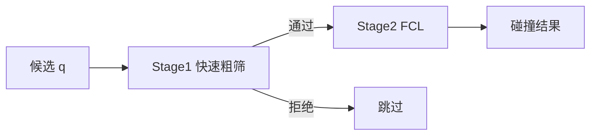

# 碰撞检测流水线设计

更新时间: 2026-06-02

## 1. 目标

把碰撞检测拆成两级:

- Stage 1: 快速粗筛
- Stage 2: 精确 FCL

这样未来可以自然插入 `AABB` / `Sphere` / `Capsule` 等低成本模型。

## 2. 接口



文件:
- `include/assembly_rtfg_cpp/collision_pipeline.h`
- `src/collision_pipeline.cpp`

## 3. 当前实现

### Stage 1

轻量检查:
- 相邻关节的过大步长
- TCP 工作空间粗约束

### Stage 2

直接复用现有 FCL:
- self collision
- tool-body collision
- tool-basin collision

当前 `CollisionPipeline` 只是把这些能力封装起来，不改变几何语义。

## 4. 是否所有候选都进 FCL

不是。

当前流程:
1. 先按 IK 误差筛候选
2. 再按 `top-k` / budget 截断
3. 只有进入 Stage 2 的候选才跑 FCL
4. playback 复检时也有 stride / keypoint 策略

## 5. 复杂度

如果候选数为 `K`，碰撞对数为 `P`:

- Stage 1: `O(K)`
- Stage 2: `O(K * P)`

因此真正的瓶颈还是 Stage 2。

## 6. 未来扩展

接口预留给:
- `AABB`
- `Sphere`
- `Capsule`

未来的实现方式是:
1. 先用几何粗模型做 broad-phase
2. 再把少量候选送进 FCL 精检

## 7. 代码示例

```cpp
rtfg::CollisionPipeline pipeline(robot, basin_boxes, cfg);
if (!pipeline.shouldRunPreciseCheck(i, keypoint)) {
  auto quick = pipeline.quickPlaybackCheck(qi, q_prev);
}
auto cm = pipeline.preciseCheck(qi);
```

