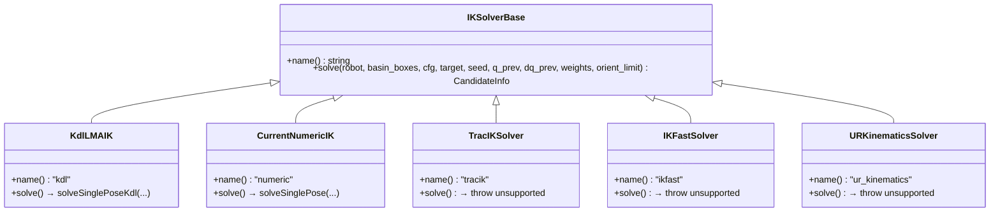

# IK 后端架构

更新时间: 2026-06-03 | 版本: v2.0

## 1. 目标

把 IK 从"写死在主流程里"抽象成**可切换后端**，支持运行时通过 `solver_backend` 参数选择。

## 2. 可用后端

| 后端 | 实现状态 | 算法 | 精度 |
|------|---------|------|------|
| **KdlLMAIK** | ✅ 已实现 (默认) | KDL Levenberg-Marquardt | pos_err ~7.7 μm |
| **CurrentNumericIK** | ✅ 已实现 (备用) | DLS 雅可比伪逆 | pos_err ~mm 级 |
| **TracIKSolver** | ⚠️ 占位接口 | TracIK | 未实现 |
| **IKFastSolver** | ⚠️ 占位接口 | IKFast 解析 | 未实现 |
| **URKinematicsSolver** | ⚠️ 占位接口 | UR 解析解 | 未实现 |

## 3. 接口设计



## 4. 工厂函数

```cpp
// src/ik_backend.cpp:60-77
std::unique_ptr<IKSolverBase> createIKSolverBackend(const SolverConfig& cfg) {
  if (cfg.solver_backend == "kdl")           return std::make_unique<KdlLMAIK>();        // 默认
  if (cfg.solver_backend == "numeric")       return std::make_unique<CurrentNumericIK>(); // 备用
  if (cfg.solver_backend == "tracik")        return std::make_unique<TracIKSolver>();    // 占位
  if (cfg.solver_backend == "ikfast")        return std::make_unique<IKFastSolver>();    // 占位
  if (cfg.solver_backend == "ur_kinematics") return std::make_unique<URKinematicsSolver>(); // 占位
  throw std::runtime_error("Unsupported ik backend: " + cfg.solver_backend);
}
```

## 5. KDL LMA (默认后端)

**实现**: `src/ik_solver.cpp:187-256` solveSinglePoseKdl

**特点**:
- 使用 KDL TreeSolver 的 Levenberg-Marquardt 优化
- 极高精度: pos_err ~7.7 μm, rot_err ~0.0004°
- 收敛迭代约 80 次 (平均)
- 在 `rtfg_solver_node.cpp:140-141` 设为默认: `solver_backend = "kdl"`

**调用路径**:
```
trajectory_solver.cpp 主循环
  → createIKSolverBackend(cfg)  // 返回 KdlLMAIK
  → backend->solve(...)         // 调用 KdlLMAIK::solve
  → solveSinglePoseKdl(...)     // src/ik_solver.cpp:187
```

## 6. DLS 数值 IK (备用后端)

**实现**: `src/ik_solver.cpp:22-111` solveSinglePose

**特点**:
- Damped Least Squares 雅可比伪逆
- 多 seed 搜索策略 (上一点解、home_q、零位、关节环绕)
- 权重调度筛候选
- 对候选执行碰撞审计

## 7. 接入新后端

未来接入只需:
1. 实现派生类 (`include/ik_backend.h`)
2. 在 `createIKSolverBackend()` 加入分支 (`src/ik_backend.cpp`)
3. 设置 `solver_backend` 参数切换

```cpp
auto backend = rtfg::createIKSolverBackend(cfg);
auto cand = backend->solve(robot, basin_boxes, cfg, target, seed, q_prev, dq_prev, weights,
                           orient_limit);
```

## 8. 复杂度

KDL LMA 的复杂度大致为:

`O(N * K * I * 6²)`

其中:
- `N` 是轨迹点数 (273)
- `K` 是 seed 数 (48)
- `I` 是 LMA 迭代次数 (~80)
- `6²` 来自 6 自由度雅可比/线性方程求解

## 9. 现阶段结论

- **`kdl` 是当前默认且推荐的后端**
- `numeric` 作为备用 (当 KDL 不收敛时)
- `tracik` / `ikfast` / `ur_kinematics` 为预留接口
- 主程序无需重构即可切换后端
- 自适应回落机制确保 KDL 高精度解中的 clearance 边界情况可被正确处理
