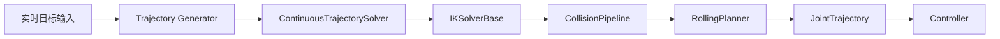

# assembly_rtfg_cpp 实时架构升级报告

更新时间: 2026-06-02

## 1. 当前架构

当前主链已经从 MATLAB GUI 迁移到 ROS2 C++:

轨迹点生成 -> 位姿变换 -> 连续轨迹求解 -> IK 后端 -> 碰撞流水线 -> playback -> JointTrajectory -> controller

同时保留了与 MATLAB 可对照的参数命名和模型基线。

## 2. 本次修改内容

### 代码层

- 新增 `solver_backend`
- 新增 `IKSolverBase` / `CurrentNumericIK`
- 新增 `CollisionPipeline`
- 新增 `ContinuousTrajectorySolver`
- 新增 `RollingPlanner`
- `rtfg_solver_node` 改为通过接口层组装求解链

### 架构层

- IK 可切换
- 碰撞检测分层
- 连续求解入口独立
- 为滚动窗口规划预留位置

## 3. 新架构设计



## 4. 当前已验证内容

- 工程可编译
- `solver_backend=numeric` 可运行
- `ContinuousTrajectorySolver` 和 `RollingPlanner` 已建立并可实例化
- `CollisionPipeline` 已接入当前主链
- `solver_mode=realtime` 在 safe 参数集下可成功返回 `success=true`
- 当前 realtime 实测约 `16.62s`，其中 `ik_total_s≈11.89s`、`collision_total_s≈4.73s`
- `solver_mode=full` 在当前 12-candidate 预算下会在第 61/276 个目标位姿触发碰撞失败，用于诊断而不是执行

## 5. 当前限制

1. `numeric` 仍是唯一实际实现的 IK 后端
2. `tracik` / `ikfast` / `ur_kinematics` 仍是接口占位
3. `RollingPlanner` 现在只做框架，不是完整滚动闭环
4. full 模式仍然偏诊断，当前 safe 工况下在较低候选预算时会提前失败；这符合 diagnostic 档位的定位

## 6. 后续接入 IKFast 路线

推荐路线:

1. 先保留 `CurrentNumericIK` 作为默认回退
2. 实现 `IKFastSolver`
3. 在 factory 中加入 `solver_backend=ikfast`
4. 逐步把重计算场景切到 `ikfast`
5. 保留 `numeric` 作为 fallback 和调试路径

## 7. 代码示例

```cpp
rtfg::SolverConfig cfg;
cfg.solver_backend = "numeric";
cfg.solver_mode = "realtime";

rtfg::ContinuousTrajectorySolver solver(robot, basin_boxes, cfg);
rtfg::RollingPlanner planner(cfg);
auto result = planner.solve(solver, tforms, segment_names, current_q, home_q);
```

## 8. 结论

这次升级的重点不是局部 `stride` 或 `top_k` 调参，而是把求解链拆成可替换模块。
后续如果要做实时控制，真正的切入点就是:
- 连续轨迹求解
- IK 后端替换
- 碰撞粗精分层
- rolling window 执行
