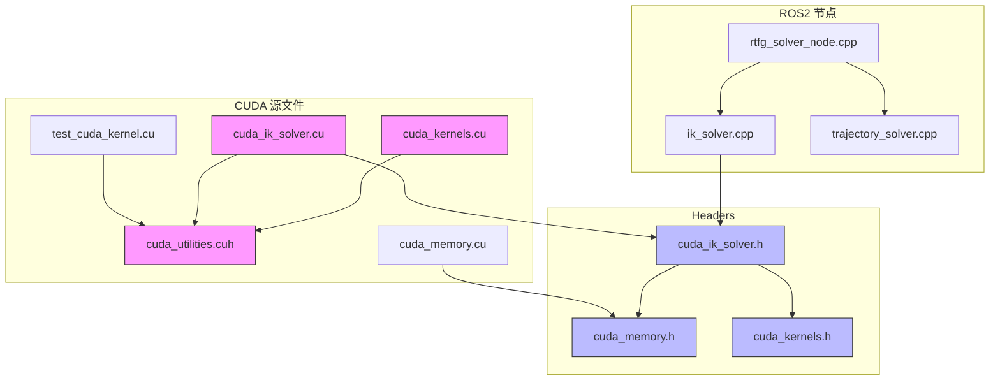

# 文件清册

## 文件总览

`assembly_rtfg_cuda` 功能包包含约 16 个文件，按功能分类如下：

```
assembly_rtfg_cuda/
├── CMakeLists.txt                    # 构建配置
├── package.xml                       # 包描述与依赖
│
├── launch/
│   └── rtfg_sim.launch.py            # ROS2 启动文件
│
├── include/assembly_rtfg_cuda/
│   ├── cuda_ik_solver.h              # CudaBatchIK 类声明
│   ├── cuda_collision.h              # GPU 碰撞检测接口声明
│   ├── cuda_kernels.h                # Kernel wrapper 声明
│   └── cuda_memory.h                 # DeviceBuffer RAII 模板
│
├── src/
│   ├── rtfg_solver_node.cpp          # ROS2 求解器节点
│   ├── ik_solver.cpp                 # IK 求解器工厂 (从 cpp 复制)
│   ├── trajectory_solver.cpp         # 轨迹求解器 (从 cpp 复制)
│   └── cuda/
│       ├── cuda_kernels.cu           # 核心 CUDA 核函数
│       ├── cuda_ik_solver.cu         # CudaBatchIK 实现
│       ├── cuda_utilities.cuh        # 设备端辅助函数/常量内存
│       └── cuda_memory.cu            # DeviceBuffer 模板实例化
│
└── test/
    └── test_cuda_kernel.cu           # GPU Kernel 测试
```

## 文件详细说明

### 1. 构建系统

| 文件 | 功能 | 关键内容 |
|------|------|---------|
| [CMakeLists.txt](03_build_system.md) | CMake 构建配置 | `enable_language(CUDA)`, `add_library(rtfg_cuda_core)`, `sm_89` |
| [package.xml](03_build_system.md) | ROS2 包描述 | 依赖: cuda-cublas-dev, cuda-cudart-dev, rclcpp |

### 2. CUDA 核心

| 文件 | 功能 | 行数 | 说明 |
|------|------|------|------|
| `src/cuda/cuda_kernels.cu` | CUDA 核函数实现 | 372 | `ik_batch_solve` + `compute_continuity_cost` |
| `src/cuda/cuda_ik_solver.cu` | CudaBatchIK 类实现 | 465 | 内存管理 + Kernel 编排 |
| `src/cuda/cuda_utilities.cuh` | 设备端辅助函数 | 295 | Rodrigues FK, LDL^T, 常量内存, 误差函数 |
| `src/cuda/cuda_memory.cu` | 模板实例化 | 19 | `template class DeviceBuffer<double/int/float>` |

### 3. 头文件

| 文件 | 功能 | 关键类/函数 |
|------|------|------------|
| `include/assembly_rtfg_cuda/cuda_ik_solver.h` | CudaBatchIK 类声明 | `class CudaBatchIK : public IKSolverBase` |
| `include/assembly_rtfg_cuda/cuda_kernels.h` | Kernel wrapper 声明 | `launch_ik_batch_solve()`, `launch_compute_continuity_cost()` |
| `include/assembly_rtfg_cuda/cuda_memory.h` | RAII 模板 | `DeviceBuffer<T>`, `ConstantMemory<T>`, `initCudaDevice()` |

### 4. ROS2 节点

| 文件 | 功能 | 关键特性 |
|------|------|---------|
| `src/rtfg_solver_node.cpp` | ROS2 求解器节点 | 服务: load_config/fit_preview/execute_cached, Pub: 轨迹/可视化 |
| `launch/rtfg_sim.launch.py` | 启动文件 | 启动 RSP, ros2_control, MoveIt2, solver, RViz2 |

### 5. 从 CPU 包复制的源文件

| 文件 | 源路径 | 功能 |
|------|--------|------|
| `src/ik_solver.cpp` | `assembly_rtfg_cpp/src/ik_solver.cpp` | IK 求解器工厂 (`createIKSolverBackend`) |
| `src/trajectory_solver.cpp` | `assembly_rtfg_cpp/src/trajectory_solver.cpp` | 轨迹求解/回放生成 |

### 6. 测试

| 文件 | 功能 | 测试内容 |
|------|------|---------|
| `test/test_cuda_kernel.cu` | GPU Kernel 综合测试 | FK 正确性, IK 收敛, 批处理压力, 连续性代价 |

### 7. 共享资源 (从 cpp 包)

编译安装时从 `assembly_rtfg_cpp` 复制：

```
config/            — 环境配置、URDF、SRDF、运动学参数
urdf/              — 机器人模型
gui/               — Python GUI 启动器
rviz/              — RViz 配置
```

## 文件依赖关系



## 相关文档

- [构建系统详解](03_build_system.md)
- [节点架构详解](04_node_architecture.md)
- [CUDA 核函数分析](../05_cuda_kernel/README.md)
- [CUDA 内存管理](../04_cuda_memory/README.md)
