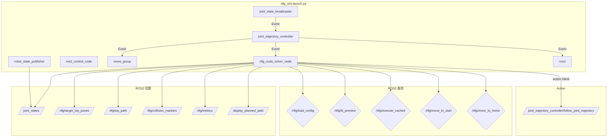

# ROS2 节点架构与依赖关系

## 节点架构总览



## rtfg_cuda_solver_node

### 节点信息

| 属性 | 值 |
|------|-----|
| 节点名 | `rtfg_solver_node` |
| 可执行文件 | `rtfg_cuda_solver_node` |
| 包 | `assembly_rtfg_cuda` |
| 实现语言 | C++17 |

### 提供的服务

| 服务名 | 类型 | 功能 |
|--------|------|------|
| `/rtfg/load_config` | `LoadConfig` | 加载运行时配置 (YAML 路径) |
| `/rtfg/fit_preview` | `FitPreview` | 执行完整轨迹拟合 (IK + 碰撞检测) |
| `/rtfg/execute_cached` | `ExecuteCached` | 执行缓存的轨迹 |
| `/rtfg/move_to_start` | `Trigger` | 移动到轨迹起始点 |
| `/rtfg/move_to_home` | `Trigger` | 移动到初始位置 |

### 发布的话题

| 话题 | 类型 | 频率 | 用途 |
|------|------|------|------|
| `/rtfg/target_tcp_poses` | `PoseArray` | 每帧 | 目标 TCP 路径 (可视化) |
| `/rtfg/tcp_path` | `PoseArray` | 每帧 | 求解的 TCP 路径 (可视化) |
| `/rtfg/collision_markers` | `MarkerArray` | 每帧 | 碰撞点标记 |
| `/rtfg/metrics` | `String` | 每帧 | 性能指标 |
| `/display_planned_path` | `DisplayTrajectory` | 每帧 | MoveIt 兼容的轨迹显示 |
| `/joint_states` | `JointState` | ~50 Hz | 仿真模式关节状态 |

### 订阅的动作

| 动作 | 类型 | 说明 |
|------|------|------|
| `/joint_trajectory_controller/follow_joint_trajectory` | `FollowJointTrajectory` | 发送轨迹到实控器 |

### 参数

| 参数 | 默认值 | 说明 |
|------|--------|------|
| `config_path` | `config/environment_runtime_config.yaml` | 运行时配置路径 |
| `solver_urdf_path` | `urdf/assembly_rtfg_solver.urdf` | 求解器 URDF |
| `base_link` | `base_jizuo` | 基坐标系 |
| `tip_link` | `sensor_shovel_tcp` | 工具坐标系 |
| `solver_backend` | `kdl` | 求解器后端 (设为 `cuda` 以使用 GPU) |
| `solver_mode` | `full` | 求解模式 (full/realtime) |
| `max_iterations_full` | 60 | 全求解最大迭代 |
| `max_iterations_realtime` | 30 | 实时模式最大迭代 |

## 启动文件依赖链

```
rtfg_sim.launch.py
    │
    ├── 1. robot_state_publisher
    │      加载 URDF → 发布 /joint_states + /robot_description
    │
    ├── 2. ros2_control_node (namespace: /rtfg)
    │      加载 ros2_controllers.yaml → 创建控制器管理器
    │
    ├── 3. joint_state_broadcaster (spawner)
    │      通过控制器管理器生成 JSB
    │
    ├── 4. joint_trajectory_controller (spawner, 在 JSB 退出后)
    │      通过控制器管理器生成 JTC
    │
    └── 5. move_group + solver_node + rviz2 (在 JTC 退出后)
            move_group: MoveIt2 规划
            solver_node: CUDA IK 求解器
            rviz2: 可视化
```

## 配置调用链

```
launch/rtfg_sim.launch.py
    │
    ├── config/environment_runtime_config.yaml
    │      运行时参数 (轨迹几何、环境位姿、初始 q)
    │
    ├── urdf/assembly_rtfg_solver.urdf
    │      机器人模型 (运动学 + 碰撞网格)
    │
    ├── config/assembly_rtfg.srdf
    │      语义描述 (碰撞组、默认姿态)
    │
    ├── config/kinematics.yaml
    │      运动学求解器配置
    │
    ├── config/joint_limits.yaml
    │      关节限位
    │
    ├── config/ompl_planning.yaml
    │      OMPL 规划器配置
    │
    ├── config/moveit_controllers.yaml
    │      MoveIt 控制器映射
    │
    └── config/ros2_controllers.yaml
        ROS2 控制器配置 (JTC/JSB)
```

## 节点间数据流

### 轨迹求解完整流程

```
1. 用户调用 fit_preview 服务
    │
2. rtfg_solver_node::onFitPreview()
    │
    ├─ buildTargetPlan(params, pose)     → 生成目标位姿序列
    ├─ buildBasinBoxes(pose)             → 构建碰撞箱
    ├─ ContinuousTrajectorySolver         → 轨迹求解器
    │       │
    │       └─ CudaBatchIK::solveBatch() → GPU IK (核心)
    │              │
    │              ├─ enqueue(targets, seeds)
    │              ├─ flush()
    │              │    ├─ H2D: cudaMemcpyAsync
    │              │    ├─ Kernel: ik_batch_solve
    │              │    ├─ D2H: cudaMemcpyAsync
    │              │    └─ cudaDeviceSynchronize
    │              └─ 返回 CandidateInfo 列表
    │
    ├─ RollingPlanner::solve()           → 连续轨迹规划
    ├─ FCL 碰撞检测                       → 安全校验
    ├─ 回放生成                           → 插值 + 时间参数化
    │
3. 返回 FitPreview.Response
```

## 相关代码行号

| 功能 | 文件 | 行号 |
|------|------|------|
| 节点类定义 | `rtfg_solver_node.cpp` | 123-763 |
| 参数声明 | `rtfg_solver_node.cpp` | 135-160 |
| fit_preview 服务 | `rtfg_solver_node.cpp` | 219-383 |
| execute_cached 服务 | `rtfg_solver_node.cpp` | 385-436 |
| 可视化发布 | `rtfg_solver_node.cpp` | 630-694 |
| 启动文件 | `launch/rtfg_sim.launch.py` | 全文件 |
