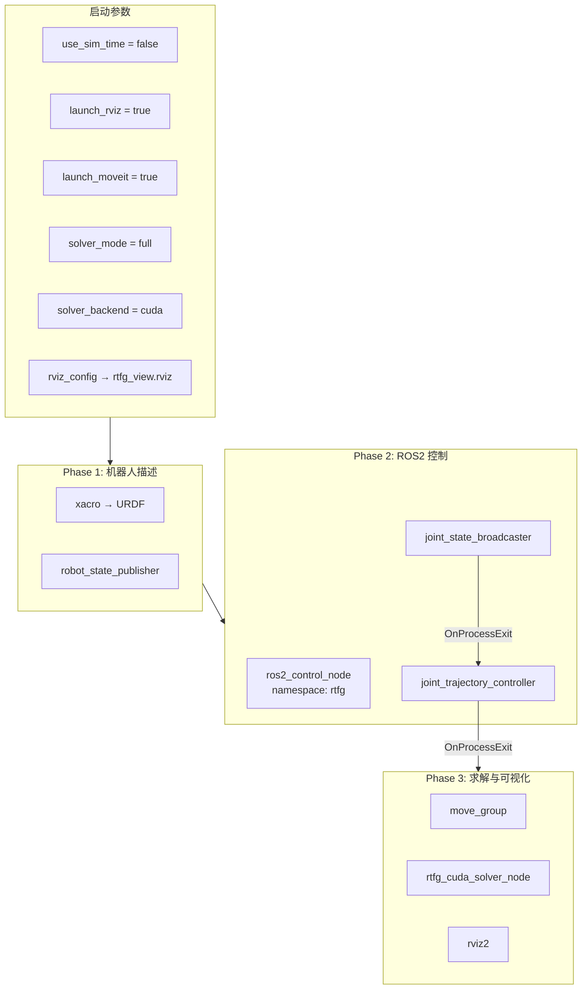

# rtfg_sim.launch.py 启动文件详解

## 文件位置

`launch/rtfg_sim.launch.py`

## 整体架构



## 启动顺序依赖

启动文件使用 `RegisterEventHandler(OnProcessExit)` 实现严格的顺序启动：

```
时间 →
├── Phase 1: robot_state_publisher + ros2_control_node (同时启动)
│   ├── robot_state_publisher 加载 URDF → 发布 robot_description
│   └── ros2_control_node 加载控制器配置 → 创建控制器管理器
│
├── Phase 2: joint_state_broadcaster (Phase 1 就绪后)
│   ├── spawner 生成 JSB
│   └── 发布 /joint_states
│
├── Phase 3: joint_trajectory_controller (JSB 退出后)
│   ├── spawner 生成 JTC
│   └── 开始监听 /follow_joint_trajectory action
│
└── Phase 4: move_group + solver_node + rviz2 (JTC 退出后)
    ├── move_group: MoveIt2 规划器
    ├── solver_node: CUDA IK 求解器节点
    └── rviz2: 可视化 (可选)
```

## 关键代码分析

### 1. 机器人描述加载

```python
xacro_path = PathJoinSubstitution([FindPackageShare("assembly_rtfg_cuda"), "urdf", "assembly_rtfg.urdf.xacro"])
robot_description_content = Command([
    FindExecutable(name="xacro"),
    " ", xacro_path,
    " ", "mesh_root:=package://assembly_rtfg_cuda/urdf/meshes",
    " ", "ros_profile:=ros2",
    " ", "ros_hardware_interface:=position",
])
```

使用 xacro 宏预处理 URDF，传递三个参数：
- `mesh_root`: 碰撞网格路径
- `ros_profile`: ROS2 兼容模式
- `ros_hardware_interface`: 位置控制接口

### 2. 配置文件加载

```python
# SRDF (语义描述)
robot_description_semantic = load_text("config/assembly_rtfg.srdf")

# 运动学参数
robot_description_kinematics = load_yaml("config/kinematics.yaml")["/**"]["ros__parameters"]["robot_description_kinematics"]

# 关节限位
robot_description_planning = load_yaml("config/joint_limits.yaml")["joint_limits"]

# OMPL 规划器
ompl_config.update(load_yaml("config/ompl_planning.yaml"))

# MoveIt 控制器映射
moveit_controllers = load_yaml("config/moveit_controllers.yaml")

# ROS2 控制器
controllers_yaml = PathJoinSubstitution([..., "config", "ros2_controllers.yaml"])
```

### 3. 求解器节点参数

```python
solver_node = Node(
    package="assembly_rtfg_cuda",
    executable="rtfg_cuda_solver_node",
    parameters=[{
        "config_path": pkg_share + "/config/environment_runtime_config.yaml",
        "solver_urdf_path": pkg_share + "/urdf/assembly_rtfg_solver.urdf",
        "base_link": "base_jizuo",
        "tip_link": "sensor_shovel_tcp",
        "clearance_threshold": 0.002,
        "solver_mode": solver_mode,        # 从启动参数传入
        "solver_backend": solver_backend,   # 从启动参数传入
        "publish_sparse_posearray_realtime": True,
        "posearray_stride_realtime": 10,
        "controller_action": "/rtfg/joint_trajectory_controller/follow_joint_trajectory",
    }]
)
```

### 4. 声明启动参数

```python
DeclareLaunchArgument("use_sim_time", default_value="false")
DeclareLaunchArgument("launch_rviz", default_value="true")
DeclareLaunchArgument("launch_moveit", default_value="true")
DeclareLaunchArgument("solver_mode", default_value="full")        # full / realtime
DeclareLaunchArgument("solver_backend", default_value="cuda")     # cuda / kdl
DeclareLaunchArgument("rviz_config", default_value=...)
```

## 使用方式

```bash
# 标准启动（CUDA 后端，全模式）
ros2 launch assembly_rtfg_cuda rtfg_sim.launch.py

# 实时模式（减少 IK 迭代次数）
ros2 launch assembly_rtfg_cuda rtfg_sim.launch.py solver_mode:=realtime

# 切换 CPU KDL 后端（对比测试）
ros2 launch assembly_rtfg_cuda rtfg_sim.launch.py solver_backend:=kdl

# 纯仿真（无 MoveIt、无 RViz）
ros2 launch assembly_rtfg_cuda rtfg_sim.launch.py launch_moveit:=false launch_rviz:=false
```

## 相关文件

| 文件 | 角色 |
|------|------|
| `launch/rtfg_sim.launch.py` | 启动编排 |
| `config/environment_runtime_config.yaml` | 运行时参数 |
| `config/ros2_controllers.yaml` | 控制器配置 |
| `config/moveit_controllers.yaml` | MoveIt 控制器映射 |
| `rviz/rtfg_view.rviz` | RViz 可视化配置 |
