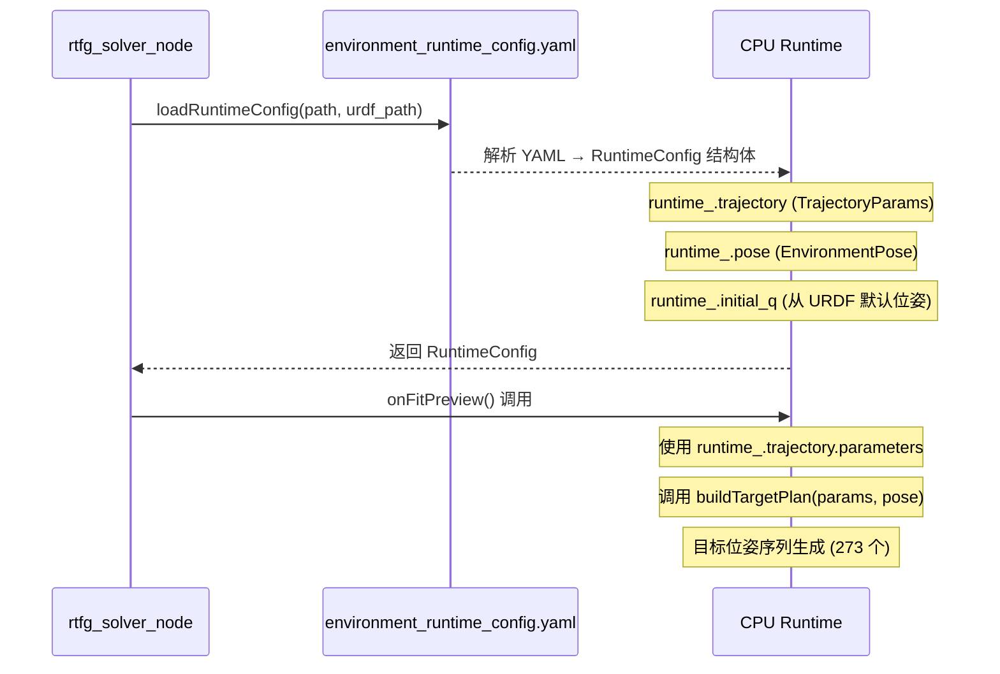

# environment_runtime_config.yaml 运行时配置

## 文件位置

`config/environment_runtime_config.yaml`（从 `assembly_rtfg_cpp` 包安装时复制）

## 配置结构

```yaml
metadata:           # 元数据（导出信息）
trajectory:         # 轨迹几何参数
  parameters:       # 可调参数（6个）
  derived_values:   # 推导值（由 CPU 端计算）
environment_pose:   # 环境位姿（6-DOF）
meanings:           # 中文字段说明
```

## 参数详解

### 轨迹参数

| 参数 | 默认值 | 单位 | 含义 |
|------|--------|------|------|
| `left_wall_offset` | 0.19533 | m | 入泥点到左侧壁的水平距离 |
| `mud_height` | 0.108 | m | 泥面距盆底的高度 |
| `approach_len` | 0.2349 | m | 起始运动点到入泥点的斜线长度 |
| `theta_deg` | -30.0 | deg | 入泥角（负值 = 向下切入） |
| `depth` | 0.05212 | m | 入泥点相对泥面的实际垂直下扎深度 |
| `x_plane` | -0.00531 | m | YOZ 轨迹所在的世界 X 截面位置 |

### 推导值

| 值 | 含义 |
|------|------|
| `approach_start_point_xyz` | 起始运动点（空中预备位） |
| `entry_point_xyz` | 入泥点 |
| `arc_end_point_xyz` | 弧结束点 |
| `approach_length` | 斜线长度 |
| `arc_radius` | 弧半径 |
| `vertical_penetration` | 垂直穿透深度 |
| `dist_x_negative_wall` | 到负 X 壁距离 |
| `dist_x_positive_wall` | 到正 X 壁距离 |

### 环境位姿

| 参数 | 默认值 | 含义 |
|------|--------|------|
| `target_joint` | `base_jizuo_to_block_with_basin_frame` | 环境连接的 TF 父节点 |
| `x` | -1.83 | 环境相对基座的 X 平移 |
| `y` | 0.0 | 环境相对基座的 Y 平移 |
| `z` | 0.0 | 环境相对基座的 Z 平移 |
| `roll_deg` | 0.0 | 绕 X 轴旋转 |
| `pitch_deg` | 0.0 | 绕 Y 轴旋转 |
| `yaw_deg` | 180.0 | 绕 Z 轴旋转 |

## 加载流程



## CPU 端代码对应

在 `rtfg_solver_node.cpp` 中：

```cpp
// 加载配置 (rtfg_solver_node.cpp:162)
runtime_ = rtfg::loadRuntimeConfig(config_path_, solver_urdf_path_);

// 构建目标轨迹 (rtfg_solver_node.cpp:248)
const auto target_plan = rtfg::buildTargetPlan(params, pose);

// 构建碰撞箱 (rtfg_solver_node.cpp:251)
const auto basin_boxes = rtfg::buildBasinBoxes(pose);
```

## 编写技巧

**调整入泥位置**: 修改 `left_wall_offset` 可左右移动入泥点。  
**调整入泥深度**: 修改 `depth` 控制铲刀下扎深度。  
**调整入泥角度**: 修改 `theta_deg`（负值向下）。  
**移动全局环境**: 修改 `environment_pose.pose` 的 x/y/z 平移环境。  
