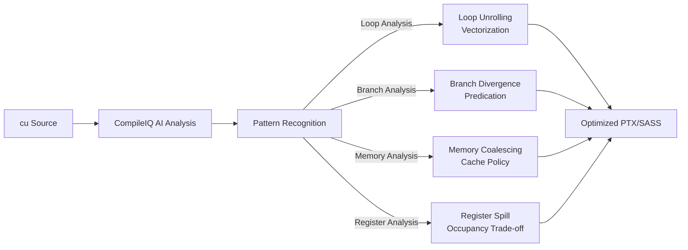

# CompileIQ AI 编译器

## 概述

CUDA 13.3 的 NVCC 集成了 CompileIQ AI 编译器，使用机器学习模型分析 CUDA Kernel 的循环/分支/内存模式，并自动选择最优编译策略。

## 工作原理



## 传统编译 vs CompileIQ

| 维度 | 传统 NVCC | CompileIQ |
|------|----------|-----------|
| 优化策略 | 预设编译器启发式 | AI 模型动态选择 |
| 循环展开 | 用户指定或简单启发式 | 分析循环体大小和依赖后决策 |
| 寄存器分配 | 固定启发式 | 动态平衡 spill 和 occupancy |
| 指令选择 | 模板匹配 | 分析数据流后选择 |
| 学习能力 | 无 | 从大量 CUDA Kernel 训练 |

## 对本功能包的潜在影响

### IK Kernel 的 CompileIQ 优化机会

| Kernel 特征 | CompileIQ 可优化的方面 |
|------------|----------------------|
| 外层 for 循环 (max_iter) | 自动展开次数决策 |
| 内层 6-循环 (行/列遍历) | 向量化加载/存储 |
| __syncthreads() 密集使用 | 同步点优化 |
| 条件分支 (s_converged) | 分支预测优化 |
| 共享内存 8 列填充 | 自动识别 padding 模式 |

### 当前编译配置

```bash
nvcc -arch=sm_89 -O3 -lineinfo --ptxas-options=-v
```

### 启用 CompileIQ

```bash
nvcc -arch=sm_89 -O3 -lineinfo --compileiq --ptxas-options=-v
```

## 预期效果

| 指标 | 传统编译 | CompileIQ (预期) |
|------|---------|-----------------|
| Kernel 性能 | 基准 | 5-15% 提升 |
| 寄存器使用 | 98/thread | 可能优化到 80-90 |
| 指令级并行 | 中等 | 改进 |
| 分支效率 | 中等 | 改进 |
| 编译时间 | 基准 | 增加 2-3× |

## 当前使用情况

本功能包**未启用** CompileIQ。当前使用传统 `-O3` 优化，已在 RTX 4060 上达到 98 寄存器/线程、0 溢出、0 bank 冲突的良好状态。

> **注意**: CompileIQ 是 CUDA 13.3 的新特性，需要一定稳定周期。建议在后续版本中测试启用。
