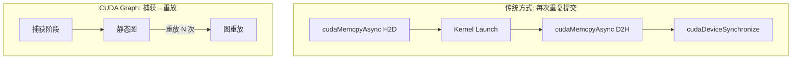
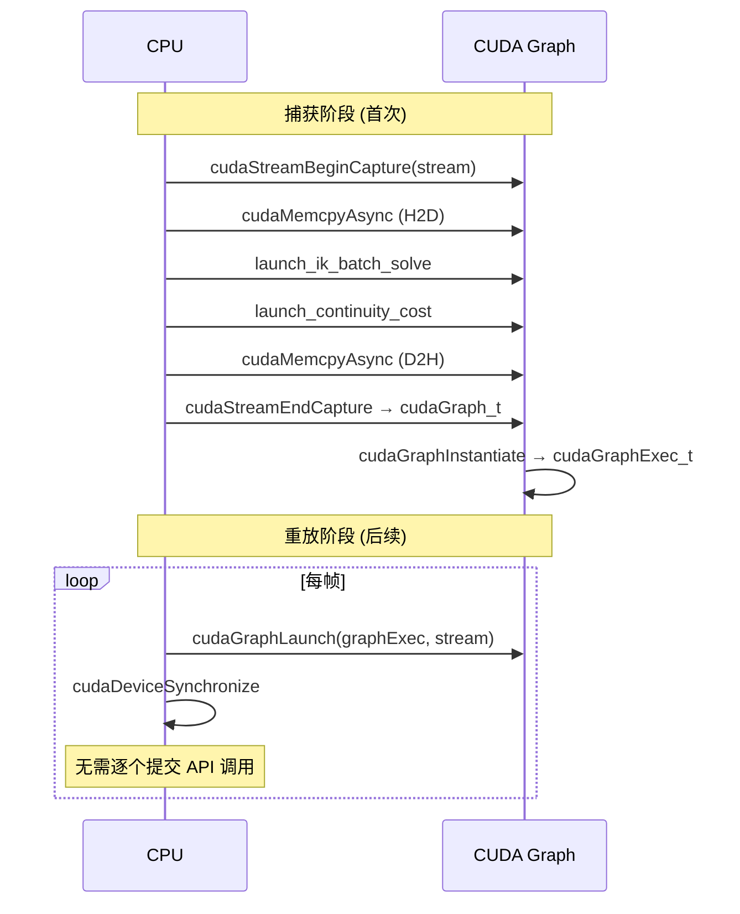
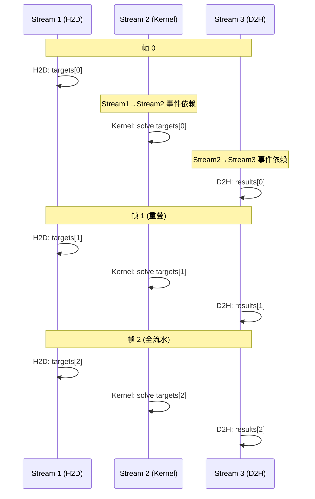

# CUDA Graphs 与多流流水线

## 概述

CUDA Graphs 允许将一系列 GPU 操作（Kernel Launch、cudaMemcpy、事件等）捕获为静态图，然后一次性提交。CUDA 13.3 增强了对动态形状的支持。

## 原理



## 对本功能包的优化应用

### 当前问题

当前单次 IK 批处理求解流程：

```
H2D (47KB) → Kernel Launch → Continuity → D2H (19KB) → Sync
```

每次 `flush()` 调用都重复提交这些操作，存在以下开销：

| 操作 | 开销 | 说明 |
|------|------|------|
| Kernel Launch | ~20 μs | CUDA runtime 调度 |
| cudaMemcpyAsync | ~5 μs | 每次拷贝的 API 调用 |
| Stream 同步 | ~2 μs | Stream 操作 |

对于 273 目标的单次求解，这些开销占比很小 (< 1%)。但在**多次**调用场景（如轨迹拟合中调用数十次）中，这些开销会累积。

### CUDA Graph 优化方案



## 多流流水线设计

### 三级流水线 (H2D/Kernel/D2H)



### 预期收益

| 优化 | 当前 | 优化后 | 收益 |
|------|------|--------|------|
| CUDA Graph | 无 | 图重放 | 减少 ~20% Launch 开销 |
| 多流流水线 | 单流串行 | 三级流水线 | 吞吐量提升 ~3× |
| 固定内存 | 分页内存 | 固定内存 | H2D 提速 ~2× |

## 实现注意事项

1. **数据更新**: 每次重放前需更新 H2D 数据（使用可写内存或 `cudaGraphUpdate`）
2. **同步**: 多流需要 `cudaEvent_t` 事件同步
3. **内存**: 需预分配所有 DeviceBuffer
4. **错误处理**: 图捕获失败需要回退到传统模式

## 当前使用情况

本功能包**未使用** CUDA Graphs 和多流流水线。当前实现：
- 单 Stream (non-blocking)
- 每次 `flush()` 单独提交所有操作
- `cudaDeviceSynchronize()` 阻塞等待
