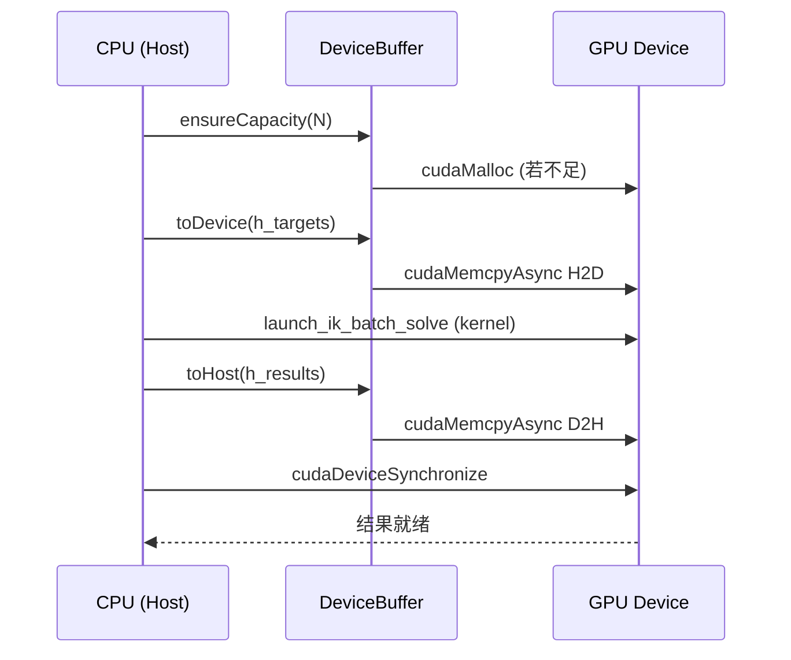

# DeviceBuffer — RAII 封装详解

## 概述

`DeviceBuffer<T>` 是 `assembly_rtfg_cuda` 中用于管理 GPU 设备内存的 RAII (Resource Acquisition Is Initialization) 封装类。它确保设备内存在 C++ 异常安全和作用域边界条件下正确分配和释放，避免了手动的 `cudaMalloc`/`cudaFree` 配对管理。

**源码位置**: `include/assembly_rtfg_cuda/cuda_memory.h:14-106`

## 类定义

```cpp
// cuda_memory.h:14-106
template <typename T>
class DeviceBuffer {
public:
    DeviceBuffer();                              // 默认构造 (空)
    explicit DeviceBuffer(size_t count);         // 分配 count 个元素
    ~DeviceBuffer();                             // RAII 释放
    
    // 非拷贝
    DeviceBuffer(const DeviceBuffer&) = delete;
    DeviceBuffer& operator=(const DeviceBuffer&) = delete;
    
    // 支持移动
    DeviceBuffer(DeviceBuffer&& other) noexcept;
    DeviceBuffer& operator=(DeviceBuffer&& other) noexcept;
    
    void resize(size_t count);                   // 重新分配
    
    void toDevice(const T* host_data,            // H2D 传输
                  size_t count, 
                  cudaStream_t stream = 0);
    void toDevice(const T* host_data);            // H2D (全量)
    
    void toHost(T* host_data,                    // D2H 传输
                size_t count, 
                cudaStream_t stream = 0) const;
    void toHost(T* host_data) const;              // D2H (全量)
    
    T* get();                                    // 获取裸指针
    const T* get() const;
    size_t size() const;                         // 元素个数
    size_t bytes() const;                        // 字节数
    bool empty() const;
};
```

## 关键实现细节

### 构造函数与内存分配

```cpp
// cuda_memory.h:19-25
explicit DeviceBuffer(size_t count) : count_(count) {
    cudaError_t err = cudaMalloc(&ptr_, count * sizeof(T));
    if (err != cudaSuccess) {
        throw std::runtime_error("cudaMalloc failed: " +
                                 std::string(cudaGetErrorString(err)));
    }
}
```

- `cudaMalloc` 在 GPU 全局内存上分配 `count * sizeof(T)` 字节
- 分配失败时抛出 C++ 异常（而非静默失败）
- 本包中 T 为 `double` (8 bytes) 或 `int` (4 bytes)

### 析构函数与自动释放

```cpp
// cuda_memory.h:27-31
~DeviceBuffer() {
    if (ptr_) {
        cudaFree(ptr_);
    }
}
```

- 对象离开作用域时自动调用 `cudaFree`
- 空指针检查确保安全
- **避免内存泄漏的关键设计**

### 移动语义

```cpp
// cuda_memory.h:38-53
DeviceBuffer(DeviceBuffer&& other) noexcept
    : ptr_(other.ptr_), count_(other.count_) {
    other.ptr_ = nullptr;    // 源对象放弃所有权
    other.count_ = 0;
}
```

- 支持 `std::move` 语义
- 移动后源对象不再拥有内存所有权
- 使 `ensureCapacity()` 中的重新分配高效安全

### 数据传输

```cpp
// cuda_memory.h:67-77
void toDevice(const T* host_data, size_t count, cudaStream_t stream = 0) {
    if (count > count_) {
        throw std::runtime_error("DeviceBuffer::toDevice: count exceeds capacity");
    }
    cudaError_t err = cudaMemcpyAsync(ptr_, host_data, count * sizeof(T),
                                       cudaMemcpyHostToDevice, stream);
    if (err != cudaSuccess) {
        throw std::runtime_error("cudaMemcpy H2D failed: " +
                                 std::string(cudaGetErrorString(err)));
    }
}
```

**核心特性**:
- 使用 `cudaMemcpyAsync`（异步传输）而非 `cudaMemcpy`（同步传输）
- 接受 `cudaStream_t` 参数（默认流 0）
- 大小检查确保不会越界写入
- 异常安全设计

### Resize 机制

```cpp
// cuda_memory.h:56-64
void resize(size_t count) {
    if (ptr_) cudaFree(ptr_);        // 释放旧内存
    count_ = count;
    cudaError_t err = cudaMalloc(&ptr_, count * sizeof(T));  // 重新分配
    if (err != cudaSuccess) {
        throw std::runtime_error("cudaMalloc (resize) failed: " + ...
    }
}
```

- 先释放旧内存，再分配新内存
- 旧数据被丢弃（不复制）
- 在 `CudaBatchIK::ensureCapacity()` 中调用

## 本包中的实例化

在 `cuda_memory.cu:17-19` 中显式实例化：

```cpp
template class DeviceBuffer<double>;
template class DeviceBuffer<int>;
template class DeviceBuffer<float>;  // 本包未使用
```

## 在 CudaBatchIK 中的使用

`CudaBatchIK` 类 (`cuda_ik_solver.cu:68-74`) 持有 5 个 DeviceBuffer 实例：

```cpp
std::unique_ptr<cuda::DeviceBuffer<double>> d_targets_;     // [N, 16]
std::unique_ptr<cuda::DeviceBuffer<double>> d_seeds_;       // [N, 6]
std::unique_ptr<cuda::DeviceBuffer<double>> d_results_;     // [N, 6]
std::unique_ptr<cuda::DeviceBuffer<double>> d_errors_;      // [N, 2]
std::unique_ptr<cuda::DeviceBuffer<double>> d_iterations_;  // [N]
```

### 典型调用流程



## 与本包其他 CUDA 内存机制的关系

```
DeviceBuffer (全局内存)
    ↓ 管理 IK 批处理的输入/输出
ConstantMemory (常量内存)
    ↓ 管理运动学参数的广播
__shared__ (共享内存)
    ↓ 核函数内部 DLS 迭代的工作空间
寄存器文件
    ↓ 每个线程的私有变量
```

## 关键设计优势

1. **异常安全**: 构造函数分配失败抛出异常，析构函数确保释放
2. **资源安全**: 对象生命周期管理设备内存，杜绝泄漏
3. **异步友好**: 默认使用 `cudaMemcpyAsync` 支持流并发
4. **延迟分配**: `ensureCapacity()` 按需分配，避免提前占用 GPU 内存
5. **移动语义**: 支持高效的 resizing 操作

## 相关代码行号

| 功能 | 文件 | 行号 |
|------|------|------|
| DeviceBuffer 类定义 | `cuda_memory.h` | 14-106 |
| 显式模板实例化 | `cuda_memory.cu` | 17-19 |
| ensureCapacity 调用 | `cuda_ik_solver.cu` | 292-308 |
| toDevice 调用 (H2D) | `cuda_ik_solver.cu` | 355-356 |
| toHost 调用 (D2H) | `cuda_ik_solver.cu` | 373-375 |
| Stream 参数传递 | `cuda_ik_solver.cu` | 359-365 |
