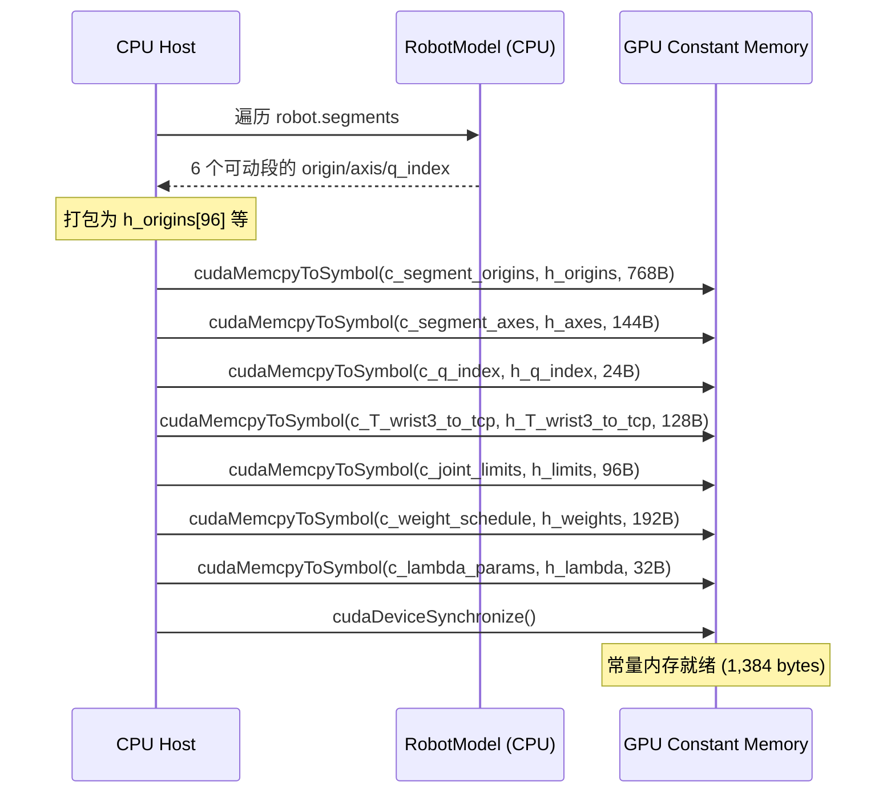

# `__constant__` 常量内存广播

## 概述

常量内存 (Constant Memory) 是 CUDA 中一种特殊的只读内存空间。其最大特点是在同一 warp 内所有线程访问**同一地址**时，数据通过广播机制同时送达所有线程，延迟仅 1 个时钟周期。本功能包利用常量内存存储 UR10 运动学参数，避免了每个线程重复从全局内存加载相同数据。

**源码位置**: `cuda_utilities.cuh:74-86`, `cuda_ik_solver.cu:261-282`

## 常量内存的技术原理

### 硬件架构

```
                    ┌─────────────────┐
                    │   常量缓存 8-10KB │ ← 每个 SM 独立
                    └────────┬────────┘
                             │ 广播通道 (64 bytes/cycle)
         ┌───────────────────┼───────────────────┐
         ▼                   ▼                   ▼
     Warp 0 Lane 0    Warp 0 Lane 1    Warp 0 Lane 31
```

- **容量**: 64 KB 全局 + 每个 SM 约 10 KB 硬件缓存
- **延迟**: 同一 warp 内所有线程读同一地址 → **1 周期** (对比全局内存 ~400 周期)
- **不同地址**: 如果 warp 内线程读不同常量地址，则串行化 (性能下降)
- **编程模型**: 使用 `__constant__` 声明 + `cudaMemcpyToSymbol` 上传

### 在 DLS 迭代中的应用

在 `ik_batch_solve` 核函数中，每次迭代需要多次读取运动学参数：

1. FK 计算: 6 次 `c_segment_origins[seg*16]` + 6 次 `c_segment_axes[seg*3]`
2. Jacobian: 6 次 FK 调用（+eps 和 -eps）
3. Hessian/Gradient: 6 次 `c_weight_schedule[0*6+k]`
4. 步长应用: 6 次 `c_joint_limits[i*2]`

**不使用常量内存的后果**: 这些参数需要 138 字节/线程从全局内存重复加载，273 blocks × 128 threads × ~15 次/迭代 × 7.9 迭代 = **~5.2 GB 额外全局内存流量**

**使用常量内存的效果**: 一次广播至所有线程，后续读取命中常量缓存 (1-周期延迟)

## 本包的常量内存声明

所有 7 个常量数组在 `cuda_utilities.cuh:74-86` 中统一声明：

```cpp
// ──────────────────────────────────────────
// 运动学参数 (6个旋转段)
// ──────────────────────────────────────────
EXTERN_CONSTANT double c_segment_origins[96];    // 6×16 = 768B
EXTERN_CONSTANT double c_segment_axes[18];       // 6×3 = 144B
EXTERN_CONSTANT int    c_q_index[6];             // 6×4 = 24B
EXTERN_CONSTANT double c_T_wrist3_to_tcp[16];    // 16×8 = 128B

// ──────────────────────────────────────────
// 约束参数
// ──────────────────────────────────────────
EXTERN_CONSTANT double c_joint_limits[12];       // 6×2×8 = 96B

// ──────────────────────────────────────────
// 求解器参数
// ──────────────────────────────────────────
EXTERN_CONSTANT double c_weight_schedule[24];    // 4×6×8 = 192B
EXTERN_CONSTANT double c_lambda_params[4];       // 4×8 = 32B
```

**总大小**: 768 + 144 + 24 + 128 + 96 + 192 + 32 = **1,384 bytes** (远小于 64 KB 上限)

### EXTERN_CONSTANT 宏模式

```cpp
// cuda_utilities.cuh:74-86
#ifdef CUDA_DEFINE_CONSTANTS
  #define EXTERN_CONSTANT __constant__      // 定义（分配存储）
#else
  #define EXTERN_CONSTANT extern __constant__  // 声明（引用外部）
#endif
```

这种模式实现"声明一次、多处引用"：
- `cuda_kernels.cu:21`: `#define CUDA_DEFINE_CONSTANTS` 后 `#include "cuda_utilities.cuh"` → **实际定义常量**
- 其他 .cu 文件 include 但不 define → **仅 extern 声明**

## 常量内存上传流程

在 `CudaBatchIK::initialize()` 中 (`cuda_ik_solver.cu:261-282`)：

```cpp
// 从 CPU 模型参数打包 → 上传到 GPU 常量内存
{
    auto check_sym = [](cudaError_t e, const char* name) {
        if (e != cudaSuccess)
            throw std::runtime_error(std::string("cudaMemcpyToSymbol(") + name +
                                     ") failed: " + cudaGetErrorString(e));
    };
    check_sym(cudaMemcpyToSymbol(c_segment_origins, h_origins, 96 * sizeof(double)),
              "c_segment_origins");
    check_sym(cudaMemcpyToSymbol(c_segment_axes, h_axes, 18 * sizeof(double)),
              "c_segment_axes");
    check_sym(cudaMemcpyToSymbol(c_q_index, h_q_index, 6 * sizeof(int)),
              "c_q_index");
    check_sym(cudaMemcpyToSymbol(c_T_wrist3_to_tcp, h_T_wrist3_to_tcp, 16 * sizeof(double)),
              "c_T_wrist3_to_tcp");
    check_sym(cudaMemcpyToSymbol(c_joint_limits, h_limits, 12 * sizeof(double)),
              "c_joint_limits");
    check_sym(cudaMemcpyToSymbol(c_weight_schedule, h_weights, 24 * sizeof(double)),
              "c_weight_schedule");
    check_sym(cudaMemcpyToSymbol(c_lambda_params, h_lambda, 4 * sizeof(double)),
              "c_lambda_params");
}
cudaDeviceSynchronize();
```

### 上传流程详解



### 数据来源：URDF → CPU RobotModel → GPU

`CudaBatchIK::initialize()` (`cuda_ik_solver.cu:160-286`) 从 `RobotModel` (CPU 端) 提取参数：

```cpp
// 段索引修复：跳过固定段，只打包可动段
int seg_idx = 0;
for (size_t i = 0; i < robot.segments.size() && seg_idx < 6; ++i) {
    if (!robot.segments[i].movable) continue;  // 跳过固定关节
    const auto& seg = robot.segments[i];
    // 复制 4×4 origin 矩阵（Eigen → row-major）
    for (int r = 0; r < 4; ++r)
        for (int c = 0; c < 4; ++c)
            h_origins[seg_idx * 16 + r * 4 + c] = seg.origin(r, c);
    seg_idx++;
}
assert(seg_idx == 6);  // 确保恰好 6 个可动段
```

**关键 Bug 修复** (`cuda_ik_solver.cu:168`): 
- 原始代码 `for (i < 6)` 遍历前 6 个段包括 2 个固定段，遗漏 wrist_2 和 wrist_3
- 修复后跳转固定段，确保 6 个旋转段全部打包

## 核函数中的常量内存访问

在 `forward_kinematics()` (`cuda_utilities.cuh:171-183`) 中通过常量内存计算正运动学：

```cpp
for (int seg = 0; seg < 6; ++seg) {
    // 从常量内存加载段原点矩阵 (广播给所有线程)
    mat44_mul(T_tip, &c_segment_origins[seg * 16], T_tmp);
    
    // 从常量内存加载旋转轴
    double theta = q[c_q_index[seg]];
    build_rotation_matrix(c_segment_axes[seg * 3 + 0],
                          c_segment_axes[seg * 3 + 1],
                          c_segment_axes[seg * 3 + 2],
                          theta, R);
    mat44_mul(T_tip, R, T_tmp);
}
```

在 Hessian 计算中 (`cuda_kernels.cu:197-211`) 通过常量内存访问权重：

```cpp
for (int k = 0; k < 6; ++k) {
    double w_k = c_weight_schedule[0 * 6 + k];  // 广播到所有 36 线程
    double w2 = w_k * w_k;
    sum += s_J[k * 8 + row] * w2 * s_J[k * 8 + col];
}
```

## 性能影响

| 指标 | 无常量内存 (理论) | 使用常量内存 (实测) |
|------|-------------------|-------------------|
| 参数加载延迟 | ~200-400 cycles (全局内存) | 1-10 cycles (常量缓存) |
| DRAM 额外流量 | ~5.2 GB (273目标×15次迭代) | **0 bytes** |
| 常量缓存命中率 | — | >95% (预期) |

## 本包中的其他常量内存封装

`cuda_memory.h:108-136` 中还定义了 `ConstantMemory<T>` 辅助类：

```cpp
template <typename T>
class ConstantMemory {
public:
    void bind(const void* symbol_ptr);       // 绑定到 __constant__ 符号
    void fromHost(const T* host_data,        // 从主机复制到常量内存
                  size_t count, 
                  cudaStream_t stream = 0);
};
```

该类提供与 `DeviceBuffer` 类似的 RAII 风格接口，但在本包的当前实现中未使用（直接在 `initialize()` 中调用 `cudaMemcpyToSymbol`）。

## 相关代码行号

| 功能 | 文件 | 行号 |
|------|------|------|
| 常量数组声明 | `cuda_utilities.cuh` | 74-86 |
| EXTERN_CONSTANT 宏 | `cuda_utilities.cuh` | 74-88 |
| CUDA_DEFINE_CONSTANTS | `cuda_kernels.cu` | 21 |
| 常量上传 | `cuda_ik_solver.cu` | 261-282 |
| FK 使用常量内存 | `cuda_utilities.cuh` | 171-183 |
| Hessian 使用权重常量 | `cuda_kernels.cu` | 197-211 |
| Joint limits 使用 | `cuda_kernels.cu` | 254-259 |
| ConstantMemory 封装 | `cuda_memory.h` | 108-136 |
