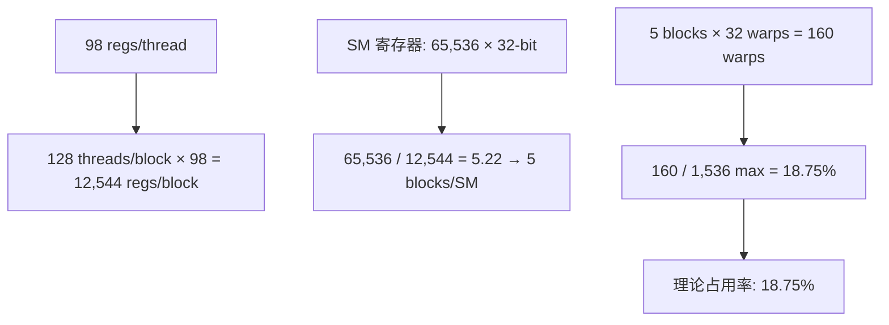

# 寄存器使用分析

## 概述

寄存器是 GPU 中**速度最快的存储**（0 周期延迟），每个线程私有。寄存器使用量直接影响 GPU 占用率：每个线程使用的寄存器越多，每个 SM 能同时运行的线程数越少。

本功能包的 `ik_batch_solve` 核函数使用 **98 个寄存器/线程**（ncu 实测），无寄存器溢出 (spill)。

**数据来源**: PTX 汇编器报告, Nsight Compute 2026.2

## 寄存器使用量

### 编译器报告

编译命令 (`cuda_kernels.cu:34-37` 编译注释):

```bash
nvcc -arch=sm_89 -O3 --ptxas-options=-v cuda_kernels.cu
```

```
ptxas info: Used 98 registers, 1676 bytes smem, 0 bytes spill stores, 0 bytes spill loads
```

**关键数字**:
- 98 registers/thread
- 1,676 bytes 共享内存/block
- **0 bytes 寄存器溢出 (spill)**
- **0 bytes 栈帧**

### 寄存器溢出 (Spill) 的代价

如果寄存器不足，编译器会将变量"溢出"到局部内存（实际在全局内存中）：

```
Spill:  每个溢出访问 → 全局内存延迟 (~400 cycles)
无溢出: 所有变量在寄存器中 → 0 周期延迟
```

**零溢出意味着** 所有 DLS 迭代变量完全保持在寄存器中，无全局内存回写。

## 占用率 (Occupancy) 计算

### 理论占用率



| 指标 | 值 | 计算 |
|------|-----|------|
| 寄存器/线程 | 98 | ncu 实测 |
| 线程/block | 128 | `blockDim(128,1,1)` |
| 寄存器/block | 12,544 | 128 × 98 |
| SM 寄存器总数 | 65,536 | Ada Lovelace 硬件规格 |
| 最大 blocks/SM | 5 | floor(65,536 / 12,544) |
| warps/SM | 160 | 5 blocks × 32 warps |
| 最大 warps/SM | 1,536 (48 warps × 32) | Ada 硬件规格 |
| **理论占用率** | **18.75%** | 160 / 1,536 |
| 实际占用率 (ncu) | ~18.75% | ncu 实测 |

### 18.75% 占用率的影响

**是否太低？** — 对于本 Kenerl 不是问题。

原因：本 Kernel 是 **计算受限** (Compute-Bound) 而非延迟受限：

| 特性 | 本 Kernel | 典型延迟受限 Kernel |
|------|-----------|-------------------|
| 算术强度 | 157 FLOP/Byte | 通常 < 10 FLOP/Byte |
| 内存带宽利用率 | 0.16% | > 80% |
| 瓶颈 | FP64 计算单元 | 内存延迟隐藏 |
| 高占用率收益 | 小（无需隐藏延迟） | 大（隐藏访存延迟） |

**结论**: 98 寄存器是编译器在 `-O3` 优化下的最优选择。降低寄存器数量虽然能提高占用率，但会导致溢出到局部内存，反而降低性能。

## 寄存器分配细节

### 主要变量驻留寄存器

以下是 `ik_batch_solve` 核函数中主要消耗寄存器的变量：

| 变量/数据结构 | 估计寄存器数 | 说明 |
|-------------|-----------|------|
| `s_q[6]` | 6 | 当前关节角（从共享内存加载） |
| `s_T[16]` | ~8 | FK 结果的寄存器缓存（部分） |
| `s_J[48]` | ~6 | Jacobian 列计算的中间值 |
| `s_H[48]` | ~4 | Hessian 累加器 |
| `s_err[6]` | ~6 | 位姿误差向量 |
| `s_dq[6]` | ~6 | 步长向量 |
| DLS 迭代循环变量 | ~10 | iter, converged, stagnation, 等 |
| `forward_kinematics` | ~20 | 局部矩阵 T_tmp[16], R[16] |
| `pose_error` | ~15 | R_cur^T * R_tgt 的局部变量 |
| `dR[9]` | ~9 | Jacobian 的旋转差分矩阵 |
| 函数调用开销 | ~8 | 返回地址, 临时值 |
| **总计** | **~98** | ncu 实测值 |

### 寄存器使用 vs 共享内存的权衡

| 数据 | 使用共享内存 (s_) | 使用寄存器 | 选择理由 |
|------|-----------------|-----------|---------|
| 当前关节角 q | s_q[48] | ✓ 加载到寄存器计算 | 每次迭代频繁读写 |
| FK 结果 T | s_T[16] | ✓ | 被多个 warp 阶段读取 |
| Jacobian | s_J[48] | ✓ (计算时) | 被 Hessian 和 Gradient 共享 |
| Hessian | s_H[48] | ✓ (计算时) | 被 LDL^T 读取 |
| 临时矩阵 T_tmp/R | — | 寄存器 (local) | 仅在 FK 函数内使用 |

**设计原则**: 被多个 warp 阶段共享的数据使用共享内存；仅线程局部使用的临时数据使用寄存器。

## PTX 汇编分析

通过 `cuobjdump -ptx` 查看生成的 PTX 代码，可以验证寄存器使用模式：

```ptx
// PTX 片段 — FK 计算中的 mat44_mul
ld.shared.f64   %fd1, [s_T+0];       // 从共享内存加载
ld.shared.f64   %fd2, [s_T+8];
...
mul.f64         %fd33, %fd1, %fd2;   // 寄存器运算
add.f64         %fd34, %fd33, %fd34;
...
st.shared.f64   [s_T+0], %fd34;      // 存回共享内存
```

## ncu 寄存器指标

```
launch__registers_per_thread           = 98
launch__shared_mem_per_block           = 1,676
sm__warps_active.avg.pct_of_peak       = ~18.75%
```

## 与其他配置的对比

| 配置 | 寄存器/线程 | 共享内存/block | 占用率 | 预计性能 |
|------|-----------|---------------|-------|---------|
| 当前 (-O3, sm_89) | **98** | 1,676 B | **18.75%** | 基准 |
| 理论: `__launch_bounds__(128, 8)` | ~96 | 1,676 B | ~25% | 略高占用率但可能溢出 |
| 理论: `-maxrregcount=64` | 64 | 1,676 B | ~50% | **强烈溢出 → 更慢** |

**重要**: 降低寄存器数量强制编译器溢出，会显著降低性能。本包保持编译器默认优化。

## 相关代码行号

| 功能 | 文件 | 行号 |
|------|------|------|
| Kernel 启动配置 | `cuda_kernels.cu` | 345-346 |
| PTX 资源报告 | NVCC 编译输出 | — |
| ncu 寄存器实测 | Nsight Compute | `launch__registers_per_thread` |
