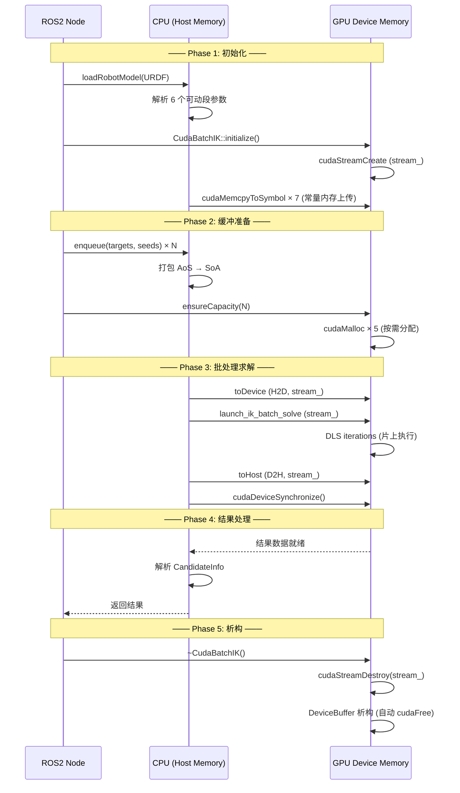

# 完整内存生命周期

## 概述

本功能包的 CUDA 内存管理涵盖从 ROS2 节点初始化到每个 IK 批处理求解的完整生命周期。理解内存的分配、传输、使用和释放过程对于整体架构的理解至关重要。

## 内存生命周期总览



## Phase 1: 初始化

### 1.1 CPU 端参数准备

`cuda_ik_solver.cu:160-286` — `CudaBatchIK::initialize()`:

1. 遍历 `robot.segments`，跳过固定段，只提取 6 个可动段
2. 从每个段的 `seg.origin` (Eigen 4×4) 提取原点矩阵
3. 从每个段的 `seg.axis` (Eigen Vector3d) 提取旋转轴
4. 从每个段的 `seg.q_index` 提取 q 映射
5. 从 `robot.T_wrist3_to_tcp` 提取工具变换
6. 从 `robot.segments` 提取 6 个关节限位
7. 生成权重调度表和阻尼参数

### 1.2 GPU 常量内存上传

`cuda_ik_solver.cu:262-282` — 7 次 `cudaMemcpyToSymbol` 调用：

| 符号 | 大小 | 内容 |
|------|------|------|
| `c_segment_origins` | 768 B | 6 段 × 4×4 原点矩阵 |
| `c_segment_axes` | 144 B | 6 段 × 3 旋转轴 |
| `c_q_index` | 24 B | 6 个 q 映射索引 |
| `c_T_wrist3_to_tcp` | 128 B | 工具变换矩阵 |
| `c_joint_limits` | 96 B | 6 × 2 限位 |
| `c_weight_schedule` | 192 B | 4 级 × 6 权重 |
| `c_lambda_params` | 32 B | 4 个阻尼参数 |

**总上传量**: 1,384 bytes (一次性, 仅初始化时执行)

## Phase 2: 缓冲准备

### 2.1 主机端队列

`cuda_ik_solver.cu:314-323` — `enqueue()`:

```cpp
void CudaBatchIK::enqueue(const Mat4& target, const Eigen::VectorXd& seed, ...) {
    PendingTarget pt;
    pt.target = target;      // 4×4 双精度矩阵
    pt.seed = seed;          // 6-DOF 关节角
    pt.weights = weights;    // 6 权重
    pt.orient_limit = orient_limit;
    pending_.push_back(pt);  // 加入队列
}
```

### 2.2 AoS → SoA 转换

`cuda_ik_solver.cu:339-351` — `flush()` 中打包：

```cpp
h_targets_.resize(N * 16);
h_seeds_.resize(N * 6);

for (int i = 0; i < N; ++i) {
    // AoS (数组 of 结构体) → SoA (结构体 of 数组)
    // 保证 GPU 端合并访问 (coalesced access)
    for (int r = 0; r < 4; ++r)
        for (int c = 0; c < 4; ++c)
            h_targets_[i * 16 + r * 4 + c] = T(r, c);
    for (int j = 0; j < 6; ++j)
        h_seeds_[i * 6 + j] = pending_[i].seed(j);
}
```

**合并访问**：GPU 端按 `tid * 16 + threadIdx.x` 访问，相邻线程读取相邻地址 → 128 bytes 合并为一个 128 字节内存事务。

### 2.3 设备内存分配

`cuda_ik_solver.cu:292-308` — `ensureCapacity()`:

```cpp
void CudaBatchIK::ensureCapacity(int N) {
    // 按需分配，不足时自动 resize
    if (!d_targets_ || d_targets_->size() < N * 16)
        d_targets_ = std::make_unique<DeviceBuffer<double>>(N * 16);
    if (!d_seeds_ || d_seeds_->size() < N * 6)
        d_seeds_ = std::make_unique<DeviceBuffer<double>>(N * 6);
    // ... 同理 d_results_, d_errors_, d_iterations_
}
```

**分配策略**: 延迟分配 + 只增不减，避免频繁 cudaMalloc/cudaFree。

## Phase 3: 批处理求解

### 3.1 H2D 传输

`cuda_ik_solver.cu:355-356`:

```cpp
d_targets_->toDevice(h_targets_.data());   // N×16 doubles → GPU
d_seeds_->toDevice(h_seeds_.data());       // N×6  doubles → GPU
```

- 使用 `cudaMemcpyAsync` (异步，由 `DeviceBuffer::toDevice` 实现)
- 在 `stream_` 上执行，可与其他流操作重叠

### 3.2 Kernel Launch

`cuda_ik_solver.cu:359-365`:

```cpp
cuda::launch_ik_batch_solve(
    d_targets_->get(), d_seeds_->get(),
    d_results_->get(), d_errors_->get(), d_iterations_->get(),
    cfg_.max_iterations, cfg_.ik_position_tolerance,
    pending_[0].orient_limit, N, stream_);
```

- Kernel 执行期间 CPU 立即返回（异步 launch）
- 所有 DLS 迭代完全在片上执行（零 DRAM 读写）

### 3.3 D2H 传输

`cuda_ik_solver.cu:373-375`:

```cpp
d_results_->toHost(h_results.data());     // N×6 doubles → CPU
d_errors_->toHost(h_errors.data());       // N×2 doubles → CPU
d_iterations_->toHost(h_iters.data());    // N doubles → CPU
```

- 异步传输，在 `stream_` 上排队
- 在 `cudaDeviceSynchronize()` 之前，CPU 可执行其他工作

### 3.4 同步

`cuda_ik_solver.cu:367`:

```cpp
cudaDeviceSynchronize();  // 等待所有操作完成
```

- 阻塞 CPU 直到 stream 和默认流上的所有操作完成
- 确保 D2H 数据完全就绪后再访问

## Phase 4: 结果处理

`cuda_ik_solver.cu:378-394` — 将 GPU 结果解析为 `CandidateInfo`:

```cpp
for (int i = 0; i < N; ++i) {
    CandidateInfo cand;
    cand.q.resize(6);
    for (int j = 0; j < 6; ++j)
        cand.q(j) = h_results[i * 6 + j];
    cand.pos_err = h_errors[i * 2 + 0];
    cand.rot_err = h_errors[i * 2 + 1];
    cand.iterations_used = static_cast<int>(h_iters[i]);
    cand.valid = (cand.pos_err < 1.0);
    results.push_back(cand);
}
pending_.clear();
```

## Phase 5: 析构

### 5.1 DeviceBuffer 自动释放

当 `CudaBatchIK` 对象析构时，其 `std::unique_ptr<DeviceBuffer>` 成员自动调用 DeviceBuffer 析构函数：

```cpp
// cuda_memory.h:27-31
~DeviceBuffer() {
    if (ptr_) {
        cudaFree(ptr_);
    }
}
```

释放 5 个缓冲区：
- `d_targets_` — 目标位姿
- `d_seeds_` — 种子关节角
- `d_results_` — 求解结果
- `d_errors_` — 误差值
- `d_iterations_` — 迭代次数

### 5.2 Stream 销毁

```cpp
// cuda_ik_solver.cu:147-151
CudaBatchIK::~CudaBatchIK() {
    if (stream_) {
        cudaStreamDestroy(stream_);
    }
}
```

## 内存状态摘要

| 阶段 | CPU 内存 | GPU 全局内存 | GPU 常量内存 | GPU 共享内存 |
|------|---------|------------|------------|------------|
| 初始化后 | RobotModel (CPU) | 空 | 1,384 bytes 参数 | 未分配 |
| 缓冲准备后 | pending_ 队列 | N×25 个 double | 同左 | 未分配 |
| Kernel 执行中 | h_targets_, h_seeds_ | N×25 doubles | 1,384 bytes | 1,616 bytes/block |
| 同步后 | h_results, h_errors | 同左 | 同左 | 释放 |
| 析构后 | 释放 | cudaFree | 释放 | — |

## 内存泄漏防护

本包通过以下机制确保零内存泄漏：

1. **RAII 封装**: DeviceBuffer 析构函数自动调用 `cudaFree`
2. **移动语义**: 安全的资源所有权转移
3. **异常安全**: 构造函数分配失败抛出异常（不产生悬空指针）
4. **双重释放防护**: 移动后源对象置 nullptr

## 相关代码行号

| 功能 | 文件 | 行号 |
|------|------|------|
| 初始化 (常量内存上传) | `cuda_ik_solver.cu` | 160-286 |
| 缓冲准备 (ensureCapacity) | `cuda_ik_solver.cu` | 292-308 |
| AoS→SoA 打包 | `cuda_ik_solver.cu` | 339-351 |
| H2D 传输 | `cuda_ik_solver.cu` | 355-356 |
| Kernel Launch | `cuda_ik_solver.cu` | 359-365 |
| D2H 传输 | `cuda_ik_solver.cu` | 373-375 |
| 同步 | `cuda_ik_solver.cu` | 367 |
| 结果解析 | `cuda_ik_solver.cu` | 378-394 |
| DeviceBuffer 析构 | `cuda_memory.h` | 27-31 |
| Stream 销毁 | `cuda_ik_solver.cu` | 147-151 |
