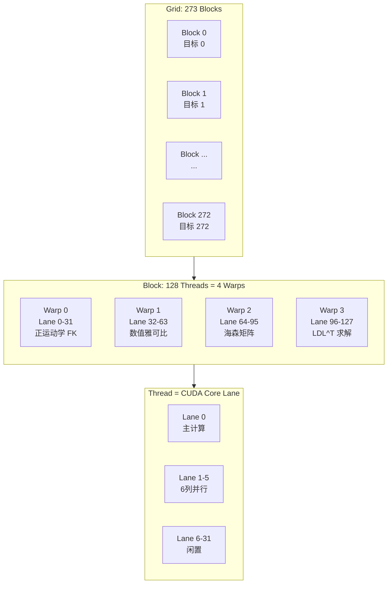

# 核函数执行模型

## 概述

`ik_batch_solve` 核函数的执行配置采用 **1 Block = 1 目标位姿** 的映射策略，充分利用了 GPU 的四层线程层次结构：Grid → Block → Warp → Thread。

**源码位置**: `cuda_kernels.cu:36-46` (Kernel 声明), `cuda_kernels.cu:345-346` (launch 配置)

## 线程层次结构

### 四层映射模型



### 执行配置

```cpp
// cuda_kernels.cu:345-346
dim3 grid(N, 1, 1);     // N = 273 (目标位姿数)
dim3 block(128, 1, 1);   // 128 线程/block = 4 warps × 32 lanes
```

### GPU 硬件映射

| CUDA 概念 | 本包配置 | GPU 硬件映射 |
|-----------|---------|-------------|
| Grid | 273 blocks | 分布在 24 个 SM 上 |
| Block | 128 threads | 调度到 1 个 SM |
| Warp | 32 threads | SM 的最小调度单位 |
| Thread | 1 lane | 1 个 CUDA Core |

## Block 间并行

### 独立求解

每个 Block 独立解决一个目标位姿的 IK 问题：

```cpp
// cuda_kernels.cu:47-48
int tid = blockIdx.x;  // Task ID = block index
if (tid >= N) return;  // 保护边界
```

- Block 之间**不需要通信**（共享内存仅在 Block 内）
- 273 个 Blocks 可以同时分配到 24 个 SM 上
- 每个 SM 最多可驻留 5 个 blocks（受寄存器限制，见 [04_cuda_memory/05_register_usage.md](../04_cuda_memory/05_register_usage.md)）

### SM 调度

```
时间 →
SM 0: | Block 0 | Block 5 | Block 10 | ...
SM 1: | Block 1 | Block 6 | Block 11 | ...
SM 2: | Block 2 | Block 7 | Block 12 | ...
...
SM 23:| Block 23| Block 28| ...      |

第一波: 24 SM × 5 blocks/SM = 120 blocks 同时运行
后续: 剩余 153 blocks 依次调度
```

## Block 内协作

### 共享内存 (Block 内共享)

```cpp
// cuda_kernels.cu:51-65 — 共享内存声明
__shared__ double s_q[48];      // 所有 128 线程共享
__shared__ double s_T[16];      // FK 结果
__shared__ double s_J[48];      // 雅可比矩阵
__shared__ double s_H[48];      // 海森矩阵
```

### __syncthreads() 同步

Block 内通过 `__syncthreads()` 实现阶段同步：

```
Warp 0  ──→ FK ──→ 同步 → 读取 s_T/J → ...
Warp 1  ──→ Jacobian ──→ 同步 → ...
Warp 2  ──→ Hessian ──→ 同步 → ...
Warp 3  ──→ LDL^T ──→ 同步 → ...
```

详细同步点见 [03_synchronization.md](../06_cpu_gpu_communication/03_synchronization.md)

## Warp 执行

### 4 Warp 分工

| Warp | 线程 ID | 功能 | 活跃线程 | 效率 |
|------|---------|------|---------|------|
| 0 | 0-31 | 正运动学 FK | Lane 0 (串行) | ~3% |
| 1 | 32-63 | 数值雅可比 6 列并行 | Lane 0-5 | ~19% |
| 2 | 64-95 | 海森矩阵 J^T·J | Lane 0-20 (21 上三角) | ~66% |
| 3 | 96-127 | LDL^T 求解 | Lane 0 (串行) | ~3% |

详细分析见 [03_warp_assignment.md](03_warp_assignment.md)

### 分支发散控制

同一 warp 内出现不同分支时，所有路径都会串行执行（分支发散）。本包通过以下方式最小化发散：

```cpp
// ✅ 良好: 线程 0-5 执行同一分支
if (threadIdx.x < 6) {
    // 所有活跃线程执行相同计算，仅列索引不同
    s_J[0*8+j] = (T_p[3] - T_m[3]) * inv_2eps;
}
// 线程 6-31 跳过（无额外延迟）
```

## 第二核函数: compute_continuity_cost

```cpp
// cuda_kernels.cu:359-362
int block_size = 256;
int grid_size = (N + block_size - 1) / block_size;
dim3 grid(grid_size);
dim3 block(block_size);
```

- 1 线程 = 1 个 IK 结果
- 简单 1D 映射，无 warp 分工
- 仅做向量范数和分支惩罚计算

## 启动配置对比

| 参数 | ik_batch_solve | compute_continuity_cost |
|------|---------------|------------------------|
| Grid | (N, 1, 1) | ((N+255)/256, 1, 1) |
| Block | (128, 1, 1) | (256, 1, 1) |
| 线程/目标 | 128 | 1 |
| 共享内存/block | 1,676 B | 0 B |
| 寄存器/线程 | 98 | ~20 |

## 关键设计理念

Block 数 = 目标数是**线程层次映射**的典型案例：

| 优點 | 說明 |
|------|------|
| 无数据竞争 | 每个目标独立求解，不需要跨 Block 同步 |
| 天然并行 | GPU 自动调度 Blocks 到 SM |
| 可扩展 | 增加目标数只增加 Blocks，不改变代码逻辑 |
| 负载均衡 | GPU 硬件自动均衡 Blocks 在 SM 的分布 |

## 相关代码行号

| 功能 | 文件 | 行号 |
|------|------|------|
| Kernel 声明 | `cuda_kernels.cu` | 36-46 |
| Block 索引计算 | `cuda_kernels.cu` | 47-48 |
| Launch 配置 | `cuda_kernels.cu` | 345-346 |
| 连续性核函数 | `cuda_kernels.cu` | 290-333 |
| Launch 包装器 | `cuda_kernels.cu` | 339-368 |
