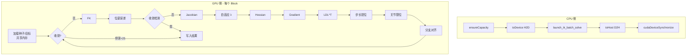

# ik_batch_solve 核函数逐行详解

## 概述

`ik_batch_solve` 是 `assembly_rtfg_cuda` 功能包的**核心核函数**，实现了加权 DLS 迭代求解器，在 GPU 上批量求解 273 个独立 IK 问题。

**源码位置**: `cuda_kernels.cu:36-288`

## 完整结构

```cpp
// cuda_kernels.cu:36-288
__global__ void ik_batch_solve(
    const double* __restrict__ d_targets,     // [N, 16] 目标位姿
    const double* __restrict__ d_seeds,        // [N, 6]  种子关节角
    double* __restrict__ d_results,            // [N, 6]  求解结果
    double* __restrict__ d_errors,             // [N, 2]  输出误差
    double* __restrict__ d_iterations,         // [N]     迭代次数
    const int    max_iter,                     // 最大迭代 (默认 100)
    const double pos_tol,                      // 位置容差 (默认 0.03 m)
    const double orient_tol,                   // 姿态容差 (默认 π/6)
    const int    N                             // 批处理数 (默认 273)
)
```

### 函数签名分析

| 参数 | 方向 | 说明 |
|------|------|------|
| `d_targets` | 输入 (GPU 全局内存) | 273 × 16 doubles, 行主序 4×4 齐次矩阵 |
| `d_seeds` | 输入 (GPU 全局内存) | 273 × 6 doubles, 初始关节角猜测 |
| `d_results` | **输出** (GPU 全局内存) | 273 × 6 doubles, 求解结果关节角 |
| `d_errors` | **输出** (GPU 全局内存) | 273 × 2 doubles: [pos_err, rot_err] |
| `d_iterations` | **输出** (GPU 全局内存) | 273 个 doubles, 实际迭代次数 |
| `max_iter` | 参数 | 最大 DLS 迭代次数 (100) |
| `pos_tol` | 参数 | 位置收敛容差 (3 cm) |
| `orient_tol` | 参数 | 姿态收敛容差 (30°) |
| `N` | 参数 | 本 block 处理的目标数 |

### `__restrict__` 指针

所有指针参数都标注了 `__restrict__`：
- 告诉编译器这些指针**不指向同一内存区域**
- 编译器可以更积极地进行缓存和指令重排优化
- 提高全局内存加载/存储的性能

## 执行分步详解

### Phase 0: Block 索引 (第 47-48 行)

```cpp
int tid = blockIdx.x;  // Task ID = block index
if (tid >= N) return;  // 边界保护
```

每个 Block 处理一个目标位姿（Grid(N,1,1) 配置）。

### Phase 1: 共享内存声明 (第 51-65 行)

声明所有共享内存变量用于 DLS 迭代的工作空间：

```
变量分布:
  关节状态:  s_q[8], s_q_ref[6], s_q_best[6]
  矩阵:      s_T[16], s_T_tgt[16], s_J[48], s_H[48]
  向量:      s_err[6], s_g[6], s_dq[6]
  标量:      s_converged, s_iter_count, s_lambda, s_best_pos_err, s_stagnation
```

### Phase 2: 数据加载 (第 67-84 行)

```cpp
// 合并读取种子关节角 (6 线程)
if (threadIdx.x < 6) {
    s_q[threadIdx.x] = d_seeds[tid * 6 + threadIdx.x];
    s_q_ref[threadIdx.x] = s_q[threadIdx.x];
}
// 合并读取目标位姿 (16 线程)
if (threadIdx.x < 16) {
    s_T_tgt[threadIdx.x] = d_targets[tid * 16 + threadIdx.x];
}
__syncthreads();

// 初始化收敛标志 (1 线程)
if (threadIdx.x == 0) {
    s_converged = 0;
    s_iter_count = 0;
    s_best_pos_err = 1e100;
    s_stagnation = 0;
}
__syncthreads();
```

### Phase 3: DLS 迭代循环 (第 87-271 行)

每次迭代包含 10 个子阶段：

```
Phase 3a: FK 计算         (Warp 0, 1 线程)
Phase 3b: 位姿误差          (Warp 0, 1 线程)
Phase 3c: 收敛检测 + 停滞跟踪 (Warp 0, 1 线程)
Phase 3d: 数值雅可比         (Warp 1, 6 线程并行)
Phase 3e: 自适应阻尼         (Warp 0, 1 线程)
Phase 3f: Hessian 构建     (Warp 2, 36 线程并行)
Phase 3g: 梯度计算          (Warp 3, 6 线程)
Phase 3h: LDL^T 求解       (Warp 3, 1 线程)
Phase 3i: 步长钳位 + 应用   (Warp 3, 1-6 线程)
Phase 3j: 分支对齐          (Warp 3, 1 线程)
```

### Phase 4: 结果写入 (第 274-287 行)

```cpp
// 合并写入关节角 (6 线程)
if (threadIdx.x < 6) {
    d_results[tid * 6 + threadIdx.x] = s_q[threadIdx.x];
}

// 最终误差评估 (1 线程)
if (threadIdx.x == 0) {
    pose_error(s_T, s_T_tgt, s_err);
    double pos_err = sqrt(s_err[0]^2 + s_err[1]^2 + s_err[2]^2);
    double rot_err = sqrt(s_err[3]^2 + s_err[4]^2 + s_err[5]^2);
    d_errors[tid * 2 + 0] = pos_err;
    d_errors[tid * 2 + 1] = rot_err;
    d_iterations[tid] = (double)s_iter_count;
}
```

## 完整调用图



## 性能数据

| 指标 | 值 |
|------|-----|
| 批处理数 | 273 目标 |
| 线程/Block | 128 |
| 总线程数 | 273 × 128 = 34,944 |
| 共享内存/Block | 1,616 bytes |
| 寄存器/线程 | 96 |
| Kernel 执行时间 | 6.434 ms |
| 单目标平均 | 24 μs |
| 单迭代平均 | 3.5 μs |
| 平均迭代次数 | 6.7 |

## 相关代码行号

| 阶段 | 文件 | 行号 |
|------|------|------|
| Kernel 声明 | `cuda_kernels.cu` | 36-46 |
| Block 索引 | `cuda_kernels.cu` | 47-48 |
| 共享内存 | `cuda_kernels.cu` | 51-65 |
| 数据加载 | `cuda_kernels.cu` | 67-84 |
| FK 计算 | `cuda_kernels.cu` | 90-93 |
| 收敛检测 | `cuda_kernels.cu` | 104-129 |
| Jacobian | `cuda_kernels.cu` | 131-173 |
| 自适应阻尼 | `cuda_kernels.cu` | 176-192 |
| Hessian | `cuda_kernels.cu` | 195-211 |
| Gradient | `cuda_kernels.cu` | 214-223 |
| LDL^T | `cuda_kernels.cu` | 226-236 |
| 步长钳位 | `cuda_kernels.cu` | 239-249 |
| 关节限位 | `cuda_kernels.cu` | 253-259 |
| 分支对齐 | `cuda_kernels.cu` | 262-269 |
| 结果写入 | `cuda_kernels.cu` | 274-287 |
