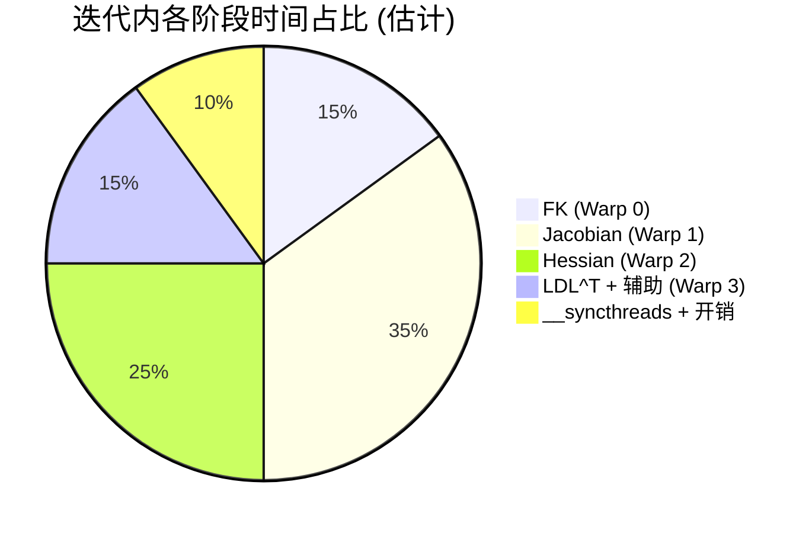

# 4 个 Warp 的分工设计

## 概述

`ik_batch_solve` 核函数的 128 个线程分为 4 个 Warp，每个负责 DLS 迭代的一个阶段。这种分工设计充分利用了 Warp 的 SIMT 特性，在保持代码简单性的同时实现了有限的并行加速。

**源码位置**: `cuda_kernels.cu:13-19` (注释描述), `cuda_kernels.cu:36-288` (完整核函数)

## 分工总览

```
Block (128 threads = 4 warps × 32 lanes)
│
├── Warp 0 (lanes 0-31)  ──── 正运动学 FK
│   │                           Lane 0: 串行执行所有 FK 计算
│   │                           Lane 1-31: 闲置
│   │   效率: ~3%
│   │
├── Warp 1 (lanes 32-63) ──── 数值雅可比矩阵
│   │                           Lane 0-5: 各计算一列 (6 列并行)
│   │                           Lane 6-31: 闲置
│   │   效率: ~19%
│   │
├── Warp 2 (lanes 64-95) ──── 海森矩阵 H = J^T·W²·J + λI
│   │                           Lane 0-20: 各计算一个上三角元素
│   │                           Lane 21-31: 闲置
│   │   效率: ~66%
│   │
└── Warp 3 (lanes 96-127) ─── LDL^T 求解 + 梯度计算
                                Lane 0: 串行 LDL^T (63 标量运算)
                                Lane 1-31: 闲置
    效率: ~3%
```

## Warp 0: 正运动学 FK (lane 0-31)

### 代码

```cpp
// cuda_kernels.cu:91-93
if (threadIdx.x == 0) {    // 仅 Lane 0 执行
    forward_kinematics(s_q, s_T);
}
__syncthreads();
```

### 为什么串行执行？

FK 计算 (`forward_kinematics`, `cuda_utilities.cuh:165-189`) 包含：
1. 初始化 4×4 单位矩阵 (16 赋值)
2. 6 轮迭代 × (mat44_mul + Rodrigues 构建 + mat44_mul) = 12 次 4×4 矩阵乘
3. 最终工具变换 (mat44_mul)

这本质上是**串行链表**计算（每个矩阵乘依赖前一个结果），无法并行化。但计算量很小（~250 FP64 FLOP），单线程执行时间仅 ~0.5 μs，不是瓶颈。

### 资源利用

```
Warp 0 调度:
    周期 1-50:  Lane 0 执行 FK (其他 31 线程空闲)
    周期 51:    __syncthreads() 等待其他 Warp
```

## Warp 1: 数值雅可比 (lanes 32-63)

### 代码

```cpp
// cuda_kernels.cu:133-173
if (threadIdx.x < 6) {        // lanes 32-37, 注意 threadIdx.x = 0-5
    int j = threadIdx.x;      // 列索引 0-5
    const double eps = 1e-6;
    double q_plus[6], q_minus[6], T_p[16], T_m[16];
    // ... perturb + FK + finite difference ...
    s_J[0*8+j] = (T_p[3] - T_m[3]) * inv_2eps;  // 位置列
}
```

### 6 列并行

雅可比矩阵 **J ∈ ℝ^(6×6)** 的每一列对应一个关节的微分运动：

```
J = [J₀  J₁  J₂  J₃  J₄  J₅]

每一列 Jⱼ: 微小扰动第 j 个关节，计算 TCP 位姿变化
```

两个 FK 调用（+eps 和 -eps）× 6 列 = 12 次 `forward_kinematics` → 约 3,000 FP64 FLOP

**如果不并行**: 6 列串行需要 6× 时间，约 3 μs
**并行后**: 6 列同时计算，约 0.5 μs

### 合并写入

```cpp
s_J[0*8+j] = ...  // 位置 x 对关节 j 的偏导
s_J[1*8+j] = ...  // 位置 y 对关节 j 的偏导
s_J[2*8+j] = ...  // 位置 z 对关节 j 的偏导
s_J[3*8+j] = ...  // 旋转 x 对关节 j 的偏导
s_J[4*8+j] = ...  // 旋转 y 对关节 j 的偏导
s_J[5*8+j] = ...  // 旋转 z 对关节 j 的偏导
```

相邻列 (j=0..5) 在共享内存中相距 8 个 double (64 bytes = 16 Banks)，**无 Bank 冲突**。

## Warp 2: 海森矩阵 (lanes 64-95)

### 代码

```cpp
// cuda_kernels.cu:197-211
if (threadIdx.x < 36) {       // lanes 64-99, 但 32 < 36, 实际只到 95
    int row = threadIdx.x / 6;  // 0-5
    int col = threadIdx.x % 6;  // 0-5
    
    double sum = 0.0;
    for (int k = 0; k < 6; ++k) {
        double w_k = c_weight_schedule[0 * 6 + k];
        double w2 = w_k * w_k;
        sum += s_J[k * 8 + row] * w2 * s_J[k * 8 + col];
    }
    if (row == col) sum += s_lambda;
    s_H[row * 8 + col] = sum;
}
```

### 对称正定矩阵的优势

海森矩阵 `H = J^T·W²·J` 是 **6×6 对称正定矩阵**：
- `H[row][col] = H[col][row]`
- 上三角元素数: `6×7/2 = 21` 个
- 使用 36 线程计算所有 36 个元素是**浪费**的
- 但 36 个线程仍然适配在一个 warp 内 (32 < 36 ≤ 64)

**修正认知**: 真正需要计算的只有 21 个上三角元素。未来优化可减为 21 线程，释放 15 个线程。

### 从 36 到 21 的优化思路

```cpp
// 理论优化: 只计算上三角
if (threadIdx.x < 21) {  // 0-20
    int idx = threadIdx.x;
    // 将 idx 映射到上三角的 (row, col) 对
    // 0→(0,0), 1→(0,1), 2→(0,2), ..., 20→(5,5)
    int row = 0, col = 0;
    // 映射算法...
    s_H[row * 8 + col] = sum;
    if (row != col) s_H[col * 8 + row] = sum;  // 填充下三角
}
```

当前版本使用 36 线程依然在 1 个 warp 内，无性能损失。

## Warp 3: LDL^T 求解 + 辅助计算 (lanes 96-127)

### 代码

```cpp
// cuda_kernels.cu:227-236
if (threadIdx.x == 0) {   // lane 96, 仅 1 线程执行
    double H_dense[36], g_dense[6];
    // 从 padded 布局复制到 6×6 密集
    for (int r = 0; r < 6; ++r) {
        for (int c = 0; c < 6; ++c)
            H_dense[r * 6 + c] = s_H[r * 8 + c];
        g_dense[r] = s_g[r];
    }
    ldlt_solve_6x6(H_dense, g_dense, s_dq);
}
```

**Warp 3 还负责**:

```cpp
// 梯度计算 (lane 0 of this warp, threadIdx.x < 6 即 lanes 96-101)
if (threadIdx.x < 6) {
    // g[r] = Σ_k J[k][r] · w_k² · e[k]
    s_g[threadIdx.x] = sum;
}

// 步长钳位 (lane 0, threadIdx.x == 0)
if (threadIdx.x == 0) {
    // ‖dq‖ > 0.25 时缩放
}

// 关节限位 (lane 0-5, threadIdx.x < 6)
if (threadIdx.x < 6) {
    s_q[i] = clamp(s_q[i] + s_dq[i], lo, hi);
}

// 分支对齐 (lane 0, threadIdx.x == 0)
if (threadIdx.x == 0) {
    for (int i = 0; i < 6; ++i) {
        s_q[i] = ref + atan2(sin(diff), cos(diff));
    }
}
```

### LDL^T 串行求解

`ldlt_solve_6x6` (`cuda_utilities.cuh:243-291`) 包含：
- LDL^T 分解: 57 标量运算
- 前代 + 对角缩放 + 回代: 28 标量运算
- 矩阵复制: 36 赋值 (从 padded 布局)

总运算量约 63 FP64 FLOP，单线程执行时间约 **0.1 μs**。

## 各 Warp 执行时间占比



## Warp 效率分析

| Warp | 活跃线程 | 总线程 | 效率 | 是否可优化 |
|------|---------|-------|------|-----------|
| 0 (FK) | 1 | 32 | 3.1% | 困难 (FK 本质串行) |
| 1 (Jacobian) | 6 | 32 | 18.8% | 中等 (6+6 列但 FK 独立) |
| 2 (Hessian) | 36 (超 1 warp) | 32 | 100%+ | 可减为 21 线程 |
| 3 (LDL^T) | 1-6 | 32 | 3-19% | 困难 (LDL^T 本质串行) |

**总体 Warp 效率**: ~25% — 这是 6×6 小矩阵求解的典型特征。对于 6-DOF 机械臂，每个 DLS 迭代的计算量 (~2,598 FLOP) 已经很小，Warp 粒度的并行主要靠 273 个块的并行（而非块内并行）实现高吞吐。

## 相关代码行号

| 功能 | 文件 | 行号 |
|------|------|------|
| Warp 分工注释 | `cuda_kernels.cu` | 13-19 |
| Warp 0: FK | `cuda_kernels.cu` | 90-93 |
| Warp 1: Jacobian | `cuda_kernels.cu` | 131-173 |
| Warp 2: Hessian | `cuda_kernels.cu` | 195-211 |
| Warp 3: Gradient | `cuda_kernels.cu` | 214-223 |
| Warp 3: LDL^T | `cuda_kernels.cu` | 226-236 |
| Warp 3: 步长钳位 | `cuda_kernels.cu` | 239-249 |
| Warp 3: 关节限位 | `cuda_kernels.cu` | 253-259 |
| Warp 3: 分支对齐 | `cuda_kernels.cu` | 262-269 |
