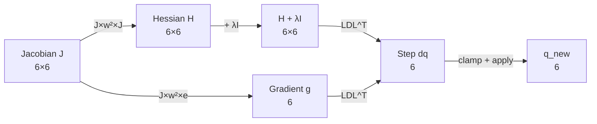

# 加权海森矩阵与梯度 (DLS 核心)

## 概述

阻尼最小二乘法 (Damped Least Squares, DLS) 是逆运动学求解的经典方法。本包实现了**加权 DLS** 公式：

$$H = J^T W^2 J + \lambda I$$
$$g = J^T W^2 e$$

其中 $W$ 是对角权重矩阵（区分位置和旋转误差），$\lambda$ 是自适应阻尼因子，$e$ 是位姿误差向量。

**源码位置**: `cuda_kernels.cu:195-223`

## 数学推导

### 标准 DLS

IK 问题可表述为：找到 $\Delta q$ 使得 TCP 误差 $\Delta x$ 最小化：

$$\min_{\Delta q} \| J \Delta q - \Delta x \|^2 + \lambda \| \Delta q \|^2$$

一阶最优条件得到：

$$(J^T J + \lambda I) \Delta q = J^T \Delta x$$

### 加权 DLS

引入权重矩阵 $W = \text{diag}(w_1, ..., w_6)$：

$$(J^T W^2 J + \lambda I) \Delta q = J^T W^2 e$$

权重 $w_k$ 区分：
- $w_0=w_1=w_2=1.0$: 位置误差全权重
- $w_3=w_4=w_5=0.20$: 旋转误差低权重（初始阶段）

### 海森矩阵 (Hessian)

$$H_{rc} = \sum_{k=1}^{6} J_{kr} \cdot w_k^2 \cdot J_{kc}$$

注意：**$w_k^2$ 而非 $w_k \cdot w_r$** —— 权重按 Jacobian 的行 (k) 而非列 (r, c) 索引。这确保了 Hessian 与梯度之间的一致性：$g_r = \sum_k J_{kr} \cdot w_k^2 \cdot e_k$。

## GPU 实现

### 海森矩阵 (36 线程并行)

```cpp
// cuda_kernels.cu:197-211
if (threadIdx.x < 36) {          // 线程 0-35
    int row = threadIdx.x / 6;   // 行索引 0-5
    int col = threadIdx.x % 6;   // 列索引 0-5

    double sum = 0.0;
    for (int k = 0; k < 6; ++k) {
        double w_k = c_weight_schedule[0 * 6 + k];  // 常量内存广播
        double w2 = w_k * w_k;
        // J[k][row] × w² × J[k][col] 累加
        sum += s_J[k * 8 + row] * w2 * s_J[k * 8 + col];
    }

    // 阻尼项：λ 仅加在对角线
    if (row == col) sum += s_lambda;

    s_H[row * 8 + col] = sum;    // 存回共享内存 (8列padding)
}
```

**计算量**: 6×6×6 = 216 次乘加 = **432 FP64 FLOP**

### 梯度向量 (6 线程并行)

```cpp
// cuda_kernels.cu:214-223
if (threadIdx.x < 6) {           // 线程 0-5
    double sum = 0.0;
    for (int k = 0; k < 6; ++k) {
        double w_k = c_weight_schedule[0 * 6 + k];
        // J[k][i] × w² × e[k] 累加
        sum += s_J[k * 8 + threadIdx.x] * w_k * w_k * s_err[k];
    }
    s_g[threadIdx.x] = sum;
}
```

**计算量**: 6×6 = 36 次乘加 = **72 FP64 FLOP**

### 权重一致性验证

Hessian 和 Gradient 使用**相同的权重平方** `w_k²`：

| 分量 | 公式 | 代码 |
|------|------|------|
| Hessian | $H_{rc} = \sum_k J_{kr} w_k^2 J_{kc}$ | `s_J[k*8+row] * w2 * s_J[k*8+col]` |
| Gradient | $g_r = \sum_k J_{kr} w_k^2 e_k$ | `s_J[k*8+threadIdx.x] * w_k * w_k * s_err[k]` |

这种一致性保证了 DLS 求解的正确性。

## 权重调度策略

权重从 `c_weight_schedule` (常量内存) 读取，当前使用 Level 0：

| 级别 | w_pos | w_rot | 用途 |
|------|-------|-------|------|
| **0** (默认) | 1.0 | 0.20 | 位置优先 + 适度姿态跟踪 |
| 1 | 1.0 | 0.10 | 位置优先 + 弱姿态跟踪 |
| 2 | 1.0 | 0.03 | 几乎仅位置 |
| 3 | 1.0 | 0.00 | 纯位置求解 |

**(当前 kernel 始终使用 Level 0；级别切换在 CPU 端 `solve()` 函数中实现)**

## 调用流程



## 关键数值特性

| 特性 | 值 | 意义 |
|------|-----|------|
| Hessian 对称性 | $H_{rc} = H_{cr}$ | 可使用 LDL^T 分解 |
| Hessian 正定性 | $x^T H x > 0$ (加 λ > 0 后) | 确保 LDL^T 稳定 |
| 条件数 | 无 λ 时可能很大 | λ > 0 改善数值稳定性 |
| 权重平方 | $w_k^2$ | 避免负数权重 |

## 相关代码行号

| 功能 | 文件 | 行号 |
|------|------|------|
| Hessian 构建 (36 线程) | `cuda_kernels.cu` | 197-211 |
| Gradient 构建 (6 线程) | `cuda_kernels.cu` | 214-223 |
| 权重从常量内存读取 | `cuda_kernels.cu` | 203 |
| 阻尼 λ 读取 | `cuda_kernels.cu` | 208 |
| 权重调度表声明 | `cuda_utilities.cuh` | 85 |
| 权重调度表上传 | `cuda_ik_solver.cu` | 246-251 |
