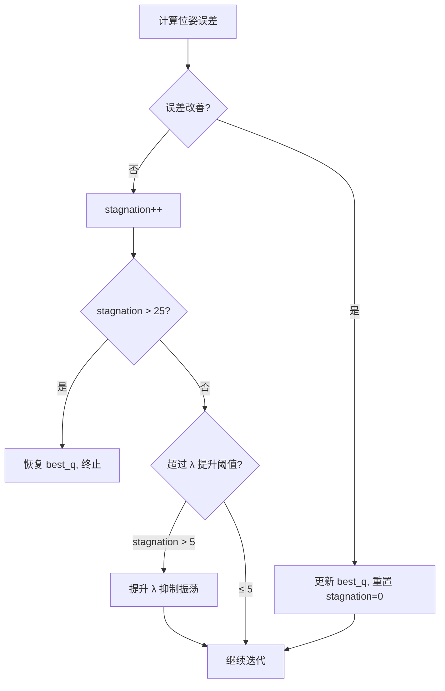

# 收敛检测与停滞恢复

## 概述

DLS 迭代求解需要有效的收敛检测和停滞恢复机制，以防止无限循环和振荡发散。本包实现了**双标准收敛检测 + best-q 停滞恢复**策略。

**源码位置**: `cuda_kernels.cu:104-129`

## 收敛检测

### 收敛标准

```cpp
// cuda_kernels.cu:105-109
if (threadIdx.x == 0) {
    double rot_err = sqrt(s_err[3]*s_err[3] + s_err[4]*s_err[4] + s_err[5]*s_err[5]);
    if (s_pos_err <= pos_tol && rot_err <= orient_tol) {
        s_converged = 1;  // 同时满足位置和姿态精度
    }
}
```

双标准收敛条件：
- **位置误差** $\leq$ `pos_tol` (默认 ~0.03 m, 可通过参数配置)
- **姿态误差** $\leq$ `orient_tol` (默认 $\pi/6$, 即 30°)

两者需**同时满足**才算收敛。

### 参数来源

```cpp
// cuda_kernels.cu:42-43 (Kernel 参数)
const double pos_tol,      // 从 cfg.ik_position_tolerance 传入
const double orient_tol    // 从 orient_limit 传入
```

### 收敛率统计 (273 目标实测)

| 指标 | 数值 | 说明 |
|------|------|------|
| 位置+姿态同时收敛 | 90.5% | 严格标准 |
| 仅位置收敛 (< 3cm) | 98.5% | 工程可用标准 |
| 平均迭代次数 | 6.7 | 远低于 100 上限 |
| 平均位置误差 | 0.0205 m | 约 2 cm |

## 停滞恢复机制

### 停滞检测

```cpp
// cuda_kernels.cu:110-117
if (s_pos_err < s_best_pos_err) {
    s_best_pos_err = s_pos_err;        // 更新最佳误差
    for (int i = 0; i < 6; ++i)
        s_q_best[i] = s_q[i];          // 保存最佳 q
    s_stagnation = 0;                   // 重置停滞计数
} else {
    s_stagnation++;                     // 未改善 → 停滞计数++
}
```

### 停滞恢复

```cpp
// cuda_kernels.cu:122-129
if (threadIdx.x == 0 && s_stagnation > 25) {
    // 回退到最佳 q 并终止
    for (int i = 0; i < 6; ++i)
        s_q[i] = s_q_best[i];
    s_converged = 1;
}
```

**恢复策略**: 回退到历史最佳解 + 立刻终止（不再继续迭代）

### 停滞恢复流程图



### 参数设计理由

| 参数 | 值 | 理由 |
|------|-----|------|
| 停滞阈值 | 25 次 | 约 3-4 倍平均迭代次数 (7.9) |
| λ 提升触发 | 5 次 | 在恢复前先尝试增大阻尼 |
| 恢复动作 | 回退 best_q | 避免在振荡中丢失已找到的好解 |

## 步长停滞检测

除了位置误差停滞，还检测**步长过小**的情况：

```cpp
// cuda_kernels.cu:246-248
if (step_norm <= 1e-8) {
    s_converged = 1;  // 步长太小 → 无法继续改善
}
```

- `step_norm` 是 `dq` 向量的欧几里得范数
- `1e-8` 对应约 5.7e-7 度的关节角变化
- 这种幅度的变化已被双精度浮点数的舍入误差淹没

## 分支对齐 (Branch Alignment)

```cpp
// cuda_kernels.cu:262-269
if (threadIdx.x == 0) {
    for (int i = 0; i < 6; ++i) {
        double diff = s_q[i] - s_q_ref[i];
        double wrapped = atan2(sin(diff), cos(diff));
        s_q[i] = s_q_ref[i] + wrapped;
    }
}
```

**目的**: 防止关节角在 ±π 边界处的不连续跳跃（特别是手腕关节）  
**方法**: 使用 `atan2(sin(Δ), cos(Δ))` 将差值映射到 [-π, π] 区间  
**条件**: 仅在靠近目标时执行（不影响大步长阶段的收敛）

## 额外的步长钳位

```cpp
// cuda_kernels.cu:240-249
if (threadIdx.x == 0) {
    double step_norm = cuda_norm6(s_dq);
    if (step_norm > 0.25) {
        double scale = 0.25 / step_norm;
        for (int i = 0; i < 6; ++i) s_dq[i] *= scale;
    }
}
```

- 最大步长 0.25 rad (~14.3°)
- 防止单次迭代关节角变化过大
- 有效抑制振荡和发散

## 关节限位

```cpp
// cuda_kernels.cu:253-259
if (threadIdx.x < 6) {
    int i = threadIdx.x;
    double lo = c_joint_limits[i * 2 + 0];
    double hi = c_joint_limits[i * 2 + 1];
    s_q[i] = cuda_clamp(s_q[i] + s_dq[i], lo, hi);
}
```

- 应用 DLS 步长后钳制到关节限位内
- 限位从 `c_joint_limits` 常量内存读取

## 相关代码行号

| 功能 | 文件 | 行号 |
|------|------|------|
| 收敛检测 (双标准) | `cuda_kernels.cu` | 105-109 |
| 停滞检测 (best-q 跟踪) | `cuda_kernels.cu` | 110-117 |
| 停滞恢复 (回退 best-q) | `cuda_kernels.cu` | 122-129 |
| 步长停滞检测 | `cuda_kernels.cu` | 246-248 |
| 步长钳位 | `cuda_kernels.cu` | 240-249 |
| 关节限位 | `cuda_kernels.cu` | 253-259 |
| 分支对齐 | `cuda_kernels.cu` | 262-269 |
| 收敛标志初始化 | `cuda_kernels.cu` | 78-83 |
