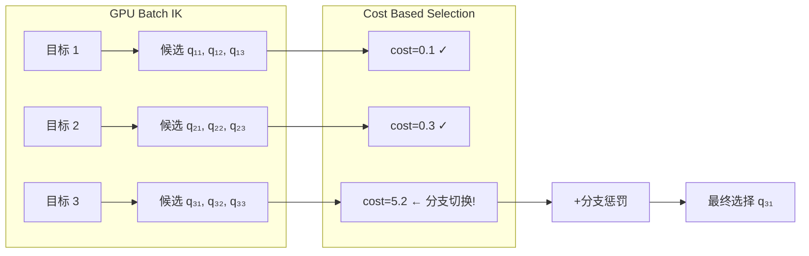
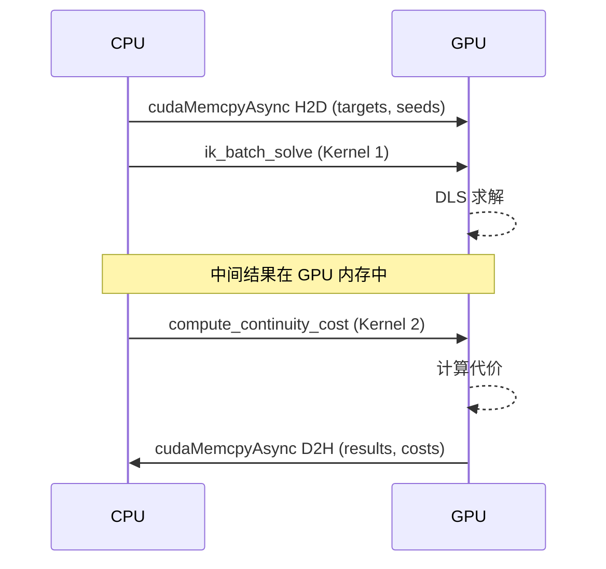

# compute_continuity_cost 连续性代价核函数

## 概述

`compute_continuity_cost` 是第二个 CUDA 核函数，用于计算每个 IK 求解结果的**连续性代价**（continuity cost），用于从多个 IK 候选中选择最平滑、最连续的轨迹解。

**源码位置**: `cuda_kernels.cu:290-333`

## 代价函数

连续性代价由三部分组成：

$$C = \|\Delta q\| + 0.65 \cdot \|\Delta q - \Delta q_{prev}\| + \text{branch\_penalty}$$

其中：
- $\Delta q = q - q_{prev}$: 当前解与上一帧关节角的差值（经分支对齐）
- $\Delta q_{prev}$: 上一帧的关节速度
- $0.65$: 速度连续性权重系数
- $\text{branch\_penalty}$: 分支切换惩罚（单关节 > 25° 时额外累加）

## GPU 实现

### 核函数

```cpp
// cuda_kernels.cu:293-333
__global__ void compute_continuity_cost(
    const double* __restrict__ d_results,     // [N, 6] IK 结果
    const double* __restrict__ d_q_prev,       // [6] 上一帧关节角
    const double* __restrict__ d_dq_prev,      // [6] 上一帧速度
    double* __restrict__ d_costs,              // [N] 输出代价
    int N) {
    
    int tid = blockIdx.x * blockDim.x + threadIdx.x;
    if (tid >= N) return;

    // 分支对齐后的关节差值
    double q[6], dq[6];
    for (int j = 0; j < 6; ++j) {
        q[j] = d_results[tid * 6 + j];
        double raw_diff = q[j] - d_q_prev[j];
        dq[j] = atan2(sin(raw_diff), cos(raw_diff));  // 分支对齐
    }

    // 范数 1: ‖Δq‖
    double norm_dq = sqrt(dq[0]*dq[0] + dq[1]*dq[1] + dq[2]*dq[2] +
                          dq[3]*dq[3] + dq[4]*dq[4] + dq[5]*dq[5]);

    // 范数 2: ‖Δq - Δq_prev‖
    double norm_diff = 0.0;
    for (int j = 0; j < 6; ++j) {
        double diff = dq[j] - d_dq_prev[j];
        norm_diff += diff * diff;
    }
    norm_diff = sqrt(norm_diff);

    double cost = norm_dq + 0.65 * norm_diff;

    // 分支切换惩罚 (>25°)
    const double BRANCH_THRESHOLD = 25.0 * CUDA_PI / 180.0;
    for (int j = 0; j < 6; ++j) {
        double raw = q[j] - d_q_prev[j];
        double abs_raw = fabs(raw);
        if (abs_raw > BRANCH_THRESHOLD) {
            cost += (abs_raw - BRANCH_THRESHOLD);
        }
    }

    d_costs[tid] = cost;
}
```

### 执行配置

```cpp
// cuda_kernels.cu:359-362
int block_size = 256;
int grid_size = (N + block_size - 1) / block_size;
dim3 grid(grid_size);
dim3 block(block_size);
```

- 1 线程处理 1 个 IK 结果
- 无共享内存使用
- 简单的 1D Grid/Block 映射

## 代价函数的工程意义

### 为什么需要连续性代价？

在轨迹规划中，同一个 TCP 位姿可以通过多个不同的关节构型实现（IK 的多解性）。连续性代价帮助选择最平滑的解：



### 分支切换惩罚

```cpp
const double BRANCH_THRESHOLD = 25.0 * CUDA_PI / 180.0;  // ~0.436 rad
```

当某个关节的变化超过 25° 时，超过的部分线性累加到代价中。这防止了 wrist_2/wrist_3 等关节在 ±π 边界处的无用切换。

## 与 ik_batch_solve 的关系



两核函数通过**全局内存**间接通信：
1. `ik_batch_solve` 将 `d_results` 写入全局内存
2. `compute_continuity_cost` 从同一全局内存读取 `d_results`

## 性能特征

| 指标 | 值 |
|------|-----|
| 每目标计算量 | ~60 FP64 FLOP |
| 执行时间 (273 目标) | < 1 μs |
| 共享内存 | 0 bytes |
| 寄存器使用 | ~20 regs/thread |
| 带宽 | 合并读取 d_results[N×6] |

## 相关代码行号

| 功能 | 文件 | 行号 |
|------|------|------|
| 核函数实现 | `cuda_kernels.cu` | 293-333 |
| Launch 包装器 | `cuda_kernels.cu` | 355-368 |
| 执行配置 | `cuda_kernels.cu` | 359-362 |
| 函数声明 (头文件) | `cuda_kernels.h` | 30-36 |
