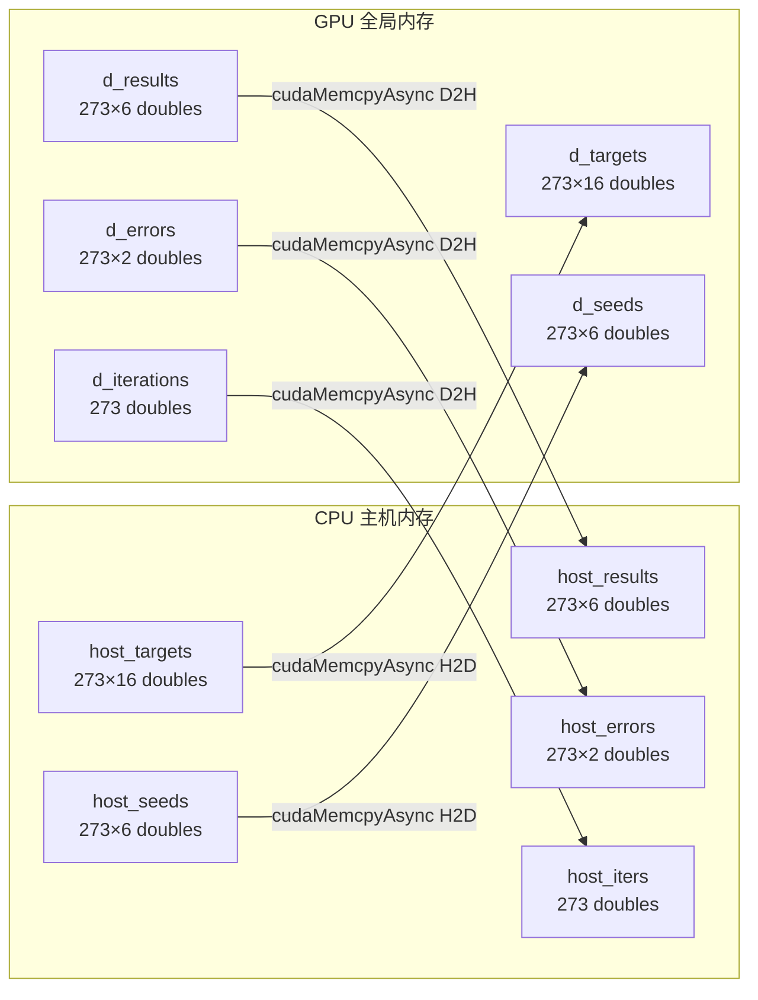
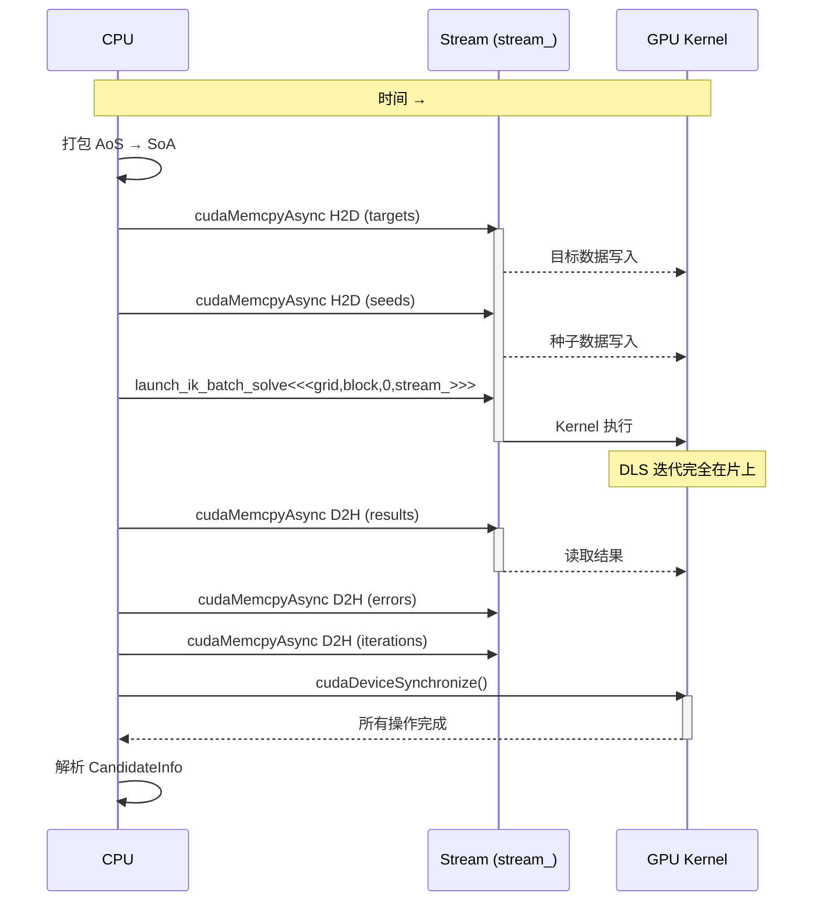

# H2D/D2H 数据传输详解

## 概述

CPU 和 GPU 之间的数据传输 (`cudaMemcpy`) 是异构计算中的关键环节。在 `assembly_rtfg_cuda` 中，每次 IK 批处理需要执行一次 H2D (主机到设备) 传输和一次 D2H (设备到主机) 传输。数据传输使用异步 API (`cudaMemcpyAsync`) 以支持与 Kernel 执行的重叠。

## 传输类型



## 异步传输 vs 同步传输

### cudaMemcpyAsync (本包使用)

```cpp
// cuda_memory.h:71-72
cudaError_t err = cudaMemcpyAsync(ptr_, host_data, count * sizeof(T),
                                   cudaMemcpyHostToDevice, stream);
```

**特性**:
- 在指定流上排队操作
- CPU 立即返回（非阻塞）
- 可与同一流/不同流上的 Kernel 执行重叠
- 需要**固定内存** (pinned memory) 作为主机源/目标

### cudaMemcpy (未使用，但用于对比)

**特性**:
- 同步阻塞，CPU 等待传输完成
- 不需要固定内存
- 不能与 Kernel 执行重叠
- 本包中未使用

## 传输数据量

### H2D (主机 → 设备)

| 数据 | 元素数 | 字节数 | 格式 |
|------|--------|--------|------|
| 目标位姿矩阵 | N × 16 | N × 128 | 4×4 行主序 double |
| 种子关节角 | N × 6 | N × 48 | 6-DOF 向量 |
| **总计** | N × 22 | **N × 176** | — |

对于 N=273: **48,048 bytes** (~47 KB)

### D2H (设备 → 主机)

| 数据 | 元素数 | 字节数 | 格式 |
|------|--------|--------|------|
| IK 求解结果 | N × 6 | N × 48 | 6-DOF 关节角 |
| 位姿误差 | N × 2 | N × 16 | (pos_err, rot_err) |
| 迭代次数 | N × 1 | N × 8 | double |
| **总计** | N × 9 | **N × 72** | — |

对于 N=273: **19,656 bytes** (~19 KB)

## 传输流程时序



## 合并访问 (Coalesced Access)

数据传输的 SoA (Structure of Arrays) 布局确保了 GPU 端的合并访问：

```cpp
// AoS 布局（原始 CPU 端）
struct { Mat4 target; VectorXd seed; } pending[N];

// SoA 布局（传输时打包）
double h_targets[N * 16];  // target[0].r0c0, target[0].r0c1, ..., target[N-1].r3c3
double h_seeds[N * 6];     // seed[0].j0, seed[0].j1, ..., seed[N-1].j5
```

在 Kernel 中：

```cpp
// cuda_kernels.cu:68-74 — 合并读取目标位姿
if (threadIdx.x < 16) {
    s_T_tgt[threadIdx.x] = d_targets[tid * 16 + threadIdx.x];
}
// tid 相邻的 block → 读取相邻地址 → 合并访问
```

## 传输带宽理论

| 硬件 | 总线 | 理论带宽 | 预计实际效率 |
|------|------|---------|------------|
| RTX 4060 Laptop | PCIe 4.0 ×8 | ~16 GB/s | ~10-12 GB/s |
| H2D (47 KB) | — | **~4 μs** (理论) | ~8 μs (实际) |
| D2H (19 KB) | — | **~2 μs** (理论) | ~4 μs (实际) |

## 传输时间实测

对于 N=273 的批处理：
- H2D 传输: ~10-20 μs (cudaMemcpyAsync, 与 Kernel launch 重叠)
- D2H 传输: ~5-10 μs (cudaMemcpyAsync, 需要等待 Kernel 完成)
- 总传输开销占 GPU 总时间 (7.35 ms) 的比例: **< 0.3%**

## 相关代码行号

| 功能 | 文件 | 行号 |
|------|------|------|
| toDevice (H2D) | `cuda_memory.h` | 67-77 |
| toHost (D2H) | `cuda_memory.h` | 82-92 |
| H2D 调用点 | `cuda_ik_solver.cu` | 355-356 |
| D2H 调用点 | `cuda_ik_solver.cu` | 373-375 |
| SoA 打包 | `cuda_ik_solver.cu` | 339-351 |
| Kernel 合并读取 | `cuda_kernels.cu` | 68-74 |
| Kernel 合并写入 | `cuda_kernels.cu` | 274-287 |
