# cudaStream_t 异步流并发

## 概述

CUDA Stream (流) 是 GPU 上操作的执行队列。同一流中的操作按入队顺序**串行执行**；不同流中的操作可以**并发执行**。本功能包创建一个专用流 (`stream_`) 用于 IK 批处理，实现了 CPU 端数据处理与 GPU 端计算的异步重叠。

**源码位置**: `cuda_ik_solver.cu:139-145`, `cuda_ik_solver.cu:359-365`

## 流的创建与销毁

### 构造函数: 创建流

```cpp
// cuda_ik_solver.cu:139-145
CudaBatchIK::CudaBatchIK() {
    cudaError_t err = cudaStreamCreate(&stream_);
    if (err != cudaSuccess) {
        throw std::runtime_error("cudaStreamCreate failed: " +
                                 std::string(cudaGetErrorString(err)));
    }
}
```

- 创建一个非阻塞流 (默认 `cudaStreamDefault` | `cudaStreamNonBlocking`)
- 流创建是**轻量级**操作
- 此时 GPU 端还未分配内存

### 析构函数: 销毁流

```cpp
// cuda_ik_solver.cu:147-151
CudaBatchIK::~CudaBatchIK() {
    if (stream_) {
        cudaStreamDestroy(stream_);
    }
}
```

- 销毁前会等待流中所有操作完成
- 如果流中有未完成的操作，`cudaStreamDestroy` 会阻塞等待

## 流的使用

### 1. 异步数据传输 (在流上)

```cpp
// cuda_ik_solver.cu:355-356
d_targets_->toDevice(h_targets_.data());  // 内部调用 cudaMemcpyAsync(..., stream_)
d_seeds_->toDevice(h_seeds_.data());      // 内部调用 cudaMemcpyAsync(..., stream_)
```

`DeviceBuffer::toDevice` (`cuda_memory.h:71-72`) 使用传入的流：

```cpp
void toDevice(const T* host_data, size_t count, cudaStream_t stream = 0) {
    cudaMemcpyAsync(ptr_, host_data, count * sizeof(T),
                     cudaMemcpyHostToDevice, stream);
}
```

### 2. Kernel Launch (在流上)

```cpp
// cuda_ik_solver.cu:359-365
cuda::launch_ik_batch_solve(
    d_targets_->get(), d_seeds_->get(),
    d_results_->get(), d_errors_->get(), d_iterations_->get(),
    cfg_.max_iterations, cfg_.ik_position_tolerance,
    pending_[0].orient_limit, N, stream_);
```

`launch_ik_batch_solve` (`cuda_kernels.cu:348`) 将流参数传递给 Kernel launch：

```cpp
ik_batch_solve<<<grid, block, 0, stream>>>(...);
```

### 3. 异步 D2H 回传 (在流上)

```cpp
// cuda_ik_solver.cu:373-375
d_results_->toHost(h_results.data());   // cudaMemcpyAsync(..., stream_)
d_errors_->toHost(h_errors.data());     // cudaMemcpyAsync(..., stream_)
d_iterations_->toHost(h_iters.data());  // cudaMemcpyAsync(..., stream_)
```

## 流的执行模型

### 流内串行 + 流间并行

```mermaid
gantt
    title 单流执行时序 (stream_)
    dateFormat X
    axisFormat %s
    
    section CPU端
    数据打包 (AoS→SoA)      :active, cpu1, 0, 0.5
    结果解析                  :active, cpu2, 5.5, 6.5
    
    section Stream_
    H2D: targets              :h2d1, 0.5, 0.6
    H2D: seeds                :h2d2, 0.6, 0.7
    ik_batch_solve Kernel     :kernel, 0.7, 5.5
    D2H: results              :d2h1, 5.5, 5.6
    D2H: errors + iters       :d2h2, 5.6, 5.7
```



**关键观察**:
1. CPU 数据打包 (0-0.5 ms) 与 GPU 传输/Kernel 执行**重叠**
2. 但当前版本中，GPU 操作在同一流上串行执行
3. Kernel 执行 (0.7-5.5 ms) 是主要时间消耗

### 默认流阻塞行为

**重要**: 本功能包使用 `cudaDeviceSynchronize()` 而非 `cudaStreamSynchronize()`:

```cpp
// cuda_ik_solver.cu:367
cudaDeviceSynchronize();  // 阻塞直到所有流完成
```

这意味着：
- 虽然 Kernel launch 是异步的 (CPU 立即返回)
- 但 `cudaDeviceSynchronize()` 阻塞 CPU 直到所有 GPU 操作完成
- 当前实现中 CPU 在同步期间无事可做 — 这是一个**可优化点**

## 多流并发的潜力

当前实现使用**单流**，所有操作串行。多流并发可以实现 H2D/Kernel/D2H 的三级重叠：

```mermaid
gantt
    title 多流重叠 (理论优化方案)
    dateFormat X
    axisFormat %s
    
    section Stream 0
    H2D: batch 0      :h2d_0, 0, 0.2
    Kernel: batch 0   :k_0, 0.2, 1.2
    
    section Stream 1
    H2D: batch 1      :h2d_1, 0.2, 0.4
    Kernel: batch 1   :k_1, 0.4, 1.4
    
    section Stream 2
    H2D: batch 2      :h2d_2, 0.4, 0.6
    Kernel: batch 2   :k_2, 0.6, 1.6
```



当前版本未实现此优化，因为单批 273 目标的 Kernel 执行时间 (7.35 ms) 已经足够快。

## 默认流与区块流

`cuda_ik_solver.cu:365` 中传递的 `stream_` 是**非阻塞流** (non-blocking stream)。这意味着：

- **不阻塞默认流**：默认流上的操作不会等待此流完成（反之亦然）
- 但如果使用了 `cudaDeviceSynchronize()`，所有流都会被等待

对比**阻塞流** (即 `cudaStreamDefault` 等价于 `cudaStreamLegacy`):
- 默认流是 `cudaStreamLegacy`: 隐式同步其他流
- 显式创建的流是 `cudaStreamNonBlocking`: 不隐式同步

## 流与事件同步的结合

流的执行顺序可以通过 CUDA Event (`cudaEvent_t`) 控制：

当前版本未显式使用 Event 进行流间同步（因为只有单流）。`cudaDeviceSynchronize()` 是唯一的同步点。

## 相关代码行号

| 功能 | 文件 | 行号 |
|------|------|------|
| cudaStreamCreate | `cuda_ik_solver.cu` | 139-145 |
| cudaStreamDestroy | `cuda_ik_solver.cu` | 147-151 |
| stream 访问器 | `cuda_ik_solver.h` | 66 |
| Kernel launch 使用 stream | `cuda_kernels.cu` | 348 |
| H2D 使用 stream | `cuda_memory.h` | 71 |
| D2H 使用 stream | `cuda_memory.h` | 86 |
| cudaDeviceSynchronize | `cuda_ik_solver.cu` | 367 |
