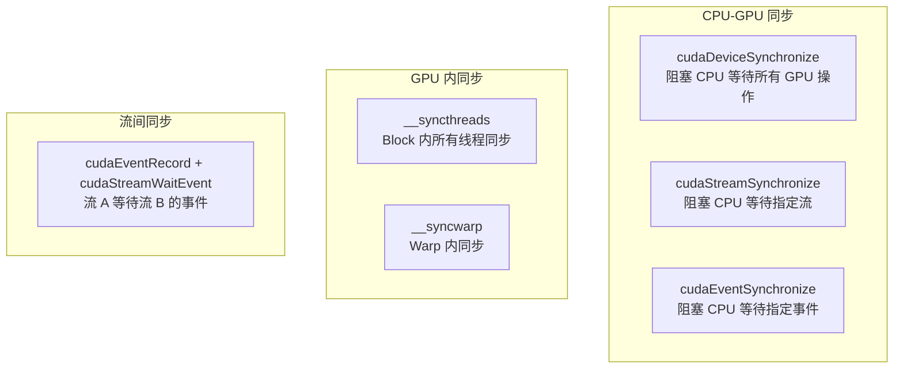
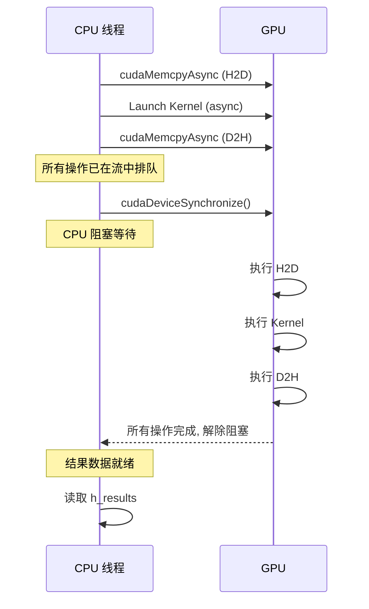

# 同步机制

## 概述

CUDA 提供了多级同步机制，确保 CPU 和 GPU 之间的操作按正确顺序执行。本功能包主要使用 `cudaDeviceSynchronize()` 进行全局同步，同时 Kernel 内部使用 `__syncthreads()` 进行 Block 内同步。

## 同步层级



## 1. cudaDeviceSynchronize() — 全局同步

**位置**: `cuda_ik_solver.cu:367`, `cuda_memory.h:150-156`

```cpp
// cuda_ik_solver.cu:367 — flush() 中
cudaDeviceSynchronize();
```

```cpp
// cuda_memory.h:150-156 — 辅助函数
inline void syncDevice() {
    cudaError_t err = cudaDeviceSynchronize();
    if (err != cudaSuccess) {
        throw std::runtime_error("cudaDeviceSynchronize failed: " +
                                 std::string(cudaGetErrorString(err)));
    }
}
```

**行为**:
- 阻塞 CPU 线程，直到**所有**流上的**所有**操作完成
- 当前包中用于等待 IK 批量求解全部结束
- 确保 D2H 数据读取时 GPU 已经完成计算

**执行模型**:



**性能影响**:
- `cudaDeviceSynchronize()` 在当前实现中造成 CPU **空闲等待**
- GPU Kernel 执行约 7.35 ms 期间，CPU 无其他工作
- 在端到端流水线中，此等待时间被流水线其他阶段掩盖

## 2. __syncthreads() — Block 内线程同步

**位置**: `cuda_kernels.cu:75, 84, 94, 102, 119, 128, 174, 193, 212, 224, 237, 250, 260, 270`

`__syncthreads()` 是 Kernel 内部最频繁使用的同步原语。其作用是在 **同一个 Block** 内所有线程到达屏障点之前，确保之前的共享内存/全局内存访问全部完成。

### 在 ik_batch_solve 中的使用

```cpp
// cuda_kernels.cu:67-75 — 加载种子和目标后同步
if (threadIdx.x < 6) {
    s_q[threadIdx.x] = d_seeds[tid * 6 + threadIdx.x];
    s_q_ref[threadIdx.x] = s_q[threadIdx.x];
}
if (threadIdx.x < 16) {
    s_T_tgt[threadIdx.x] = d_targets[tid * 16 + threadIdx.x];
}
__syncthreads();  // 确保所有数据加载完成
```

### 同步屏障位置

| 位置 | 行号 | 目的 |
|------|------|------|
| 数据加载后 | 75 | 确保种子和目标全部加载到共享内存 |
| 收敛变量初始化后 | 84 | 确保 s_converged 等标志初始化 |
| FK 计算后 | 94 | 确保 s_T 就绪后供所有线程使用 |
| 位姿误差计算后 | 102 | 确保 s_err 就绪 |
| 收敛检测后 | 119 | 确保 s_converged 被所有线程读取 |
| 停滞恢复后 | 128 | 确保最佳 q 已恢复 |
| Jacobian 计算后 | 174 | 确保 s_J 完全就绪 |
| 自适应阻尼后 | 193 | 确保 s_lambda 就绪 |
| Hessian 计算后 | 212 | 确保 s_H 完全就绪 |
| Gradient 计算后 | 224 | 确保 s_g 就绪 |
| LDL^T 求解后 | 237 | 确保 s_dq 就绪 |
| 步长钳位后 | 250 | 确保 s_dq 钳位完成 |
| 关节限位应用后 | 260 | 确保 s_q 更新完成 |
| 分支对齐后 | 270 | 准备下一轮迭代 |

### 无死锁保证

本包中的所有 `__syncthreads()` 都放在条件分支**外部**（所有线程都会到达），确保不会死锁：

```cpp
// ✅ 正确：所有线程都执行 __syncthreads()
if (threadIdx.x < 6) { /* 只有6个线程执行 */ }
__syncthreads();  // 所有128个线程都执行同步

// ❌ 错误（本包未使用）：
if (threadIdx.x < 6) {
    __syncthreads();  // 部分线程未执行 → 死锁！
}
```

## 3. __syncwarp() — Warp 内同步

本包未显式使用 `__syncwarp()`，因为：
1. Warp 0 (FK) 由 Lane 0 串行执行，无需同步
2. Warp 1 (Jacobian) 各 Lane 独立计算 6 列，无依赖
3. Warp 2 (Hessian) 各 Lane 独立计算上三角元素
4. Warp 3 (LDL^T) 仅 Lane 0 运行

隐式地，同一 warp 内的指令执行本身就是 SIMT 同步的——warp 内线程在 warp 调度器控制下执行相同指令。

## 4. 初始化同步

```cpp
// cuda_ik_solver.cu:284
cudaDeviceSynchronize();
```

在 `initialize()` 中，所有常量内存上传 (`cudaMemcpyToSymbol`) 完成后执行 `cudaDeviceSynchronize()`：
- 确保 GPU 常量内存完全就绪
- 防止后续 Kernel launch 读取到未初始化的常量数据

## 5. 隐式同步点

CUDA 中存在一些隐式同步场景，本功能包未依赖这些：

| 操作 | 是否导致同步 | 本包影响 |
|------|------------|---------|
| `cudaMalloc` | 同步 | 在 CPU 端调用，不影响 Kernel |
| `cudaFree` | 同步 | 析构时调用 |
| `cudaSetDevice` | 同步 | 仅调用一次 |
| 默认流 (stream 0) 上的操作 | 与某些旧 API 同步 | 本包使用显式流 |

## 相关代码行号

| 功能 | 文件 | 行号 |
|------|------|------|
| cudaDeviceSynchronize (flush) | `cuda_ik_solver.cu` | 367 |
| cudaDeviceSynchronize (init) | `cuda_ik_solver.cu` | 284 |
| syncDevice 辅助函数 | `cuda_memory.h` | 150-156 |
| __syncthreads (数据加载) | `cuda_kernels.cu` | 75 |
| __syncthreads (迭代循环) | `cuda_kernels.cu` | 94, 102, 119, 128, 174, 193, 212, 224, 237, 250, 260, 270 |
