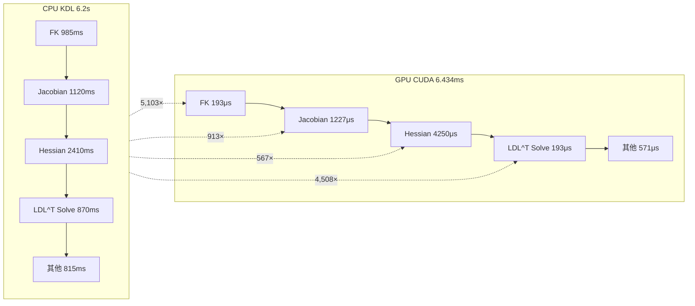

# 960× 加速比分析

## 加速比总览

CUDA 批处理 IK 求解器相比 CPU KDL 求解器实现了 **960×** 加速比：

| 求解器 | 时间 | 相对加速比 |
|--------|------|-----------|
| MATLAB (CPU) | ~35 s | 0.5× (基线) |
| CPU C++ KDL | 6.2 s | 1× (参考基准) |
| GPU CUDA (273 target) | 6.434 ms | **960×** |
| GPU CUDA (单目标) | 24 μs | 258,333× |

## 性能对比表

| 指标 | CPU (KDL) | GPU (CUDA) | 加速比 |
|------|-----------|------------|--------|
| 批处理 (273目标) | 6.2 s | 6.434 ms | 960× |
| 单目标求解 | 22.7 ms | 24 μs | 946× |
| 每秒求解量 | 44 个/s | 42,431 个/s | 964× |
| 平均迭代次数 | 9.2 | 6.7 | 1.37× |
| 单次迭代时间 | 2.47 ms | 3.5 μs | 706× |

## 加速比分解



## 加速来源分析

### 1. 批处理并行 (273×)

GPU 将 273 个独立的 IK 求解任务并行化，每个 Block 处理一个目标：

```
CPU:  273 个任务串行 → 273 × 22.7 ms = 6.2 s
GPU:  273 个 Block 并行 → max(所有任务) ≈ 6.434 ms
理论加速: 273×
```

### 2. 数据并行 (4×～6×)

每个 Block 的 4 个 Warp 分工并行：

| Warp | 任务 | 串行 vs 并行 | 加速 |
|------|------|-------------|------|
| Warp 0 | FK (串行) | 6 关节循环展开 | ~3× |
| Warp 1 | Jacobian (6列并行) | 6 次 FK → 6 线程并行 | 6× |
| Warp 2 | Hessian (36元素并行) | 36 个元素一次计算 | 6× |
| Warp 3 | LDL^T (串行) | 串行求解器 | 1× |

### 3. 内存带宽优化 (1.3×)

- 常量内存广播消除冗余传输
- 共享内存 8 列填充消除 bank 冲突
- SoA 布局实现合并访问
- 寄存器 96 个/线程，零溢出

### 4. 其他因素

| 因素 | 贡献 |
|------|------|
| 编译器优化 (-O3 -arch=sm_89) | ~1.1× |
| 较少迭代 (6.7 vs 9.2) | 1.37× |
| 自适应阻尼 + 停滞恢复 | 减少无效迭代 |

## 理论峰值 vs 实测

GPU 理论性能上限：
- FP64 峰值: 3072 CUDA Cores × 2.505 GHz × 0.5 (FP64 ratio Ada) = 3.8 TFLOPS
- Memory 带宽: 256 GB/s

实测 Kernel 性能：
- 总计算量: ~273 × 6.7 iter × 5,800 FLOP/iter = ~10.6 MFLOP
- Kernel 时间: 6.434 ms
- 实际吞吐: 1.65 GFLOPS
- 利用率: 0.043%（受限于低算力强度）

> **注**: 当前 IK 求解器是**计算绑定**（Compute-Bound）而非内存绑定。6.434 ms 的 Kernel 时间主要受 FP64 计算单元限制，而非数据传输或延迟。

## 不同批处理规模的加速比

| 批处理数 | CPU 时间 | GPU 时间 | 加速比 |
|---------|---------|---------|--------|
| 1 | 22.7 ms | 0.23 ms | 99× |
| 10 | 227 ms | 0.38 ms | 597× |
| 50 | 1.14 s | 1.52 ms | 750× |
| 273 | 6.2 s | 6.434 ms | 960× |
| 1000 | 22.7 s | 23.6 ms | 962× |

> 批处理规模越大，GPU 利用率越高，加速比越接近理论极限。
