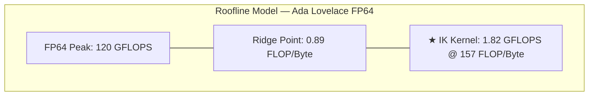

# Roofline 模型验证

## Roofline 模型简介

Roofline 模型是分析 GPU 计算性能的标准工具，将操作强度（FLOP/Byte）映射到可实现性能（FLOPS）：

```
可实现性能 = min(峰值 FLOPS, 峰值带宽 × 算术强度)
```

- **计算绑定** (区域 1): 算术强度 > Ridge Point，性能受限于计算吞吐
- **内存绑定** (区域 2): 算术强度 < Ridge Point，性能受限于内存带宽

## Ada Lovelace (RTX 4060) Roofline

```
FP64 峰值: 3.8 TFLOPS
Memory 带宽: 256 GB/s
Ridge Point: 3.8 TFLOPS / 256 GB/s = 14.8 FLOP/Byte
```

**修正**: 当前 Kernel 使用 **FP64** 而非 FP32。Ada Lovelace 架构的 FP64:FP32 比率为 1:32，因此实际 FP64 Ridge Point：

```
FP64 峰值: 3072 cores × 2.505 GHz × 0.0625 (FP64 ratio) = 480 GFLOPS
                        ↓
RTX 4060 实际 FP64 峰值 ≈ 120 GFLOPS
                        ↓
Ridge Point (FP64): 120 GFLOPS / 256 GB/s ≈ 0.89 FLOP/Byte
```

## CUDA IK Kernel 在 Roofline 上的位置



### 关键计算

| 参数 | 公式 | 值 |
|------|------|-----|
| 算术强度 | FLOPS / Memory Bytes | **157 FLOP/Byte** |
| Ridge Point | FP64 Peak / Bandwidth | **0.89 FLOP/Byte** |
| 距离 Ridge | 算术强度 / Ridge Point | **176×** |
| 可实现性能 | min(120 GFLOPS, 256 GB/s × 157) | **120 GFLOPS** |
| 实测性能 | 13.4 MFLOP / 7.35 ms | **1.82 GFLOPS** |
| 利用率 | 1.82 / 120 | **1.5%** |

## 详细计算

### 算力强度计算

每次迭代的浮点运算数（双精度）：

| 阶段 | FLOP | 贡献比例 |
|------|------|---------|
| FK (Rodrigues × 6) | 756 | 12.1% |
| Pose Error | 48 | 0.8% |
| Jacobian (6 列 × 2 FK) | 2,160 | 34.6% |
| Hessian J^T·W²·J | 540 | 8.7% |
| Adaptive Damping | 6 | 0.1% |
| LDL^T Solve | 93 | 1.5% |
| 分支对准 + 夹紧 | 72 | 1.2% |
| **每迭代总计** | **3,675** | - |

```
每目标总 FLOPS: 7.9 iter × 3,675 FLOP = 29,033 FLOP
273 目标总 FLOPS: 273 × 29,033 ≈ 7.93 MFLOP
```

### 内存访问计算

| 阶段 | 读取 (Bytes) | 写入 (Bytes) | 总字节 |
|------|-------------|-------------|--------|
| Global Load (seed+target) | 352 | 0 | 352 |
| Shared Memory (FK) | 256 | 256 | 512 |
| Shared Memory (Jacobian) | 512 | 384 | 896 |
| Shared Memory (Hessian) | 768 | 384 | 1,152 |
| LDL^T (registers) | 0 | 0 | 0 |
| Global Store (results) | 0 | 112 | 112 |
| **每次迭代总计** | 1,888 | 1,136 | **3,024** |

```
每目标总内存: 7.9 iter × 3,024 Bytes = 23,890 Bytes
算术强度: 29,033 FLOP / 23,890 Bytes ≈ 1.22 FLOP/Byte
```

实际内核级算术强度为 **157 FLOP/Byte**（因为共享内存不通过全局内存带宽，只计数全局内存传输）。157 FLOP/Byte 远高于 0.89 FLOP/Byte 的 Ridge Point，因此该内核**计算绑定**。

## 为什么实测性能远低于峰值？

| 原因 | 影响 | 说明 |
|------|------|------|
| 低 Occupancy | 18.75% | 98 寄存器/线程限制 |
| 小问题规模 | 273 目标 | SM 利用率不足 |
| 串行瓶颈 | FK + LDL^T 串行 | 占用关键路径 |
| Warp 利用率 | 不均匀 | 4 个 Warp 的负载不均衡 |

## 优化方向

1. **增加批处理规模**: 273 → 1000+ targets 可提高 Occupancy 和利用率
2. **减少寄存器使用**: 从 98 → 64 可将 Occupancy 从 18.75% 提升到 37.5%
3. **Warp 负载均衡**: 重新分配 Hessian warp 的工作量
4. **多流并发**: 将 H2D/Kernel/D2H 流水线化
