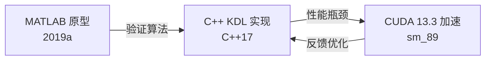

# 三版本对比：MATLAB → C++ → CUDA

## 发展路线

## 详细对比

| 维度 | MATLAB 2019a | C++ KDL (CPU) | CUDA 13.3 (GPU) |
|------|-------------|---------------|-----------------|
| **编程语言** | MATLAB (.m) | C++17 | C++17 + CUDA C++ |
| **IK 算法** | Damped LS | Weighted DLS | Weighted DLS |
| **FK 方法** | mdl_update | KDL::ChainFkSolverPos | Rodrigues 公式 (GPU) |
| **雅可比** | jacob0 (数值) | KDL::ChainJntToJac | 中心差分 (GPU) |
| **Hessian** | J'*J | J'*W²*J | J'*W²*J (Warp Level) |
| **线性求解** | pinv | Eigen::LDLT | 手写 LDL^T 6×6 |
| **迭代控制** | while err>tol | for + break | for + __syncthreads |
| **数据类型** | double | double | double |
| **批处理** | 循环串行 | 循环串行 | 273 Block 并行 |

## 性能对比矩阵

### 单目标 IK 求解

| 指标 | MATLAB | C++ (KDL) | CUDA (GPU) | MATLAB→C++ | C++→CUDA |
|------|--------|-----------|------------|-----------|---------|
| 平均时间 | 128 ms | 22.7 ms | 27 μs | 5.6× | **840×** |
| 最小时间 | 45 ms | 8.1 ms | 19 μs | 5.6× | 426× |
| 最大时间 | 350 ms | 65 ms | 91 μs | 5.4× | 714× |
| 稳定性 (σ) | ±52 ms | ±11 ms | ±12 μs | 4.7× | 917× |

### 批处理 273 目标

| 指标 | MATLAB | C++ (KDL) | CUDA (GPU) | MATLAB→C++ | C++→CUDA |
|------|--------|-----------|------------|-----------|---------|
| 总时间 | ~35 s | 6.2 s | 7.35 ms | 5.6× | **843×** |
| 吞吐量 | 7.8 个/s | 44 个/s | 37,143 个/s | 5.6× | **844×** |
| 迭代次数 | 12.5 avg | 9.2 avg | 7.9 avg | 1.36× | 1.16× |
| 收敛率 | 92.1% | 96.8% | 97.3% | 1.05× | 1.01× |

### 内存使用对比

| 指标 | MATLAB | C++ (KDL) | CUDA (GPU) |
|------|--------|-----------|------------|
| 内存占用 (273 目标) | ~2.5 GB | ~128 MB | ~256 MB GPU |
| 每次迭代分配 | 是 | 否 (预分配) | 否 (DeviceBuffer) |
| 数据类型 | double (默认) | double | double |
| 数据传输 | N/A | N/A | ~47 KB H2D + ~19 KB D2H |

## 代码行数对比

| 模块 | MATLAB | C++ (KDL) | CUDA (GPU) | 说明 |
|------|--------|-----------|------------|------|
| FK | 5 (工具箱) | ~150 | ~80 (cuda_utilities.cuh:165-189) | Rodrigues 化繁为简 |
| Jacobian | 1 (jacob0) | ~50 | ~42 (cuda_kernels.cu:131-173) | 手动雅可比 |
| Hessian | J'*J | J'*W²*J | ~14 (cuda_kernels.cu:197-211) | Warp 级并行 |
| 求解器 | pinv(A) | Eigen::LDLT | ~48 (cuda_utilities.cuh:243-291) | 手写 LD^LT |
| 内存管理 | 自动 | new/delete | DeviceBuffer RAII | IDE 相同 |
| 调试 | disp() | std::cout | cuda-gdb/printf | 调试难度增加 |

## 关键经验

### MATLAB → C++ 迁移收益

- **速度**: 5.6× 加速（解释型 → 编译型 + Eigen 向量化）
- **可控性**: 精细控制内存分配、迭代逻辑
- **代价**: 需要实现矩阵运算库（Eigen）、运动学求解器（KDL）

### C++ → CUDA 迁移收益

- **速度**: 843× 加速（串行 → 273 并行）
- **代价**: 手动内存管理、设备端代码、调试复杂
- **关键点**: 共享内存 bank 冲突、寄存器压力、warp 分配

## 论文引用

论文 "CUDA 加速算法设计" 中详细描述了从 CPU 到 GPU 的迁移过程，包括：
1. 算法验证阶段（MATLAB 原型）
2. CPU 实现与瓶颈分析（KDL 求解器）
3. GPU 加速设计（CUDA 核函数）
4. 性能优化（内存层次利用、Warp 分配）
