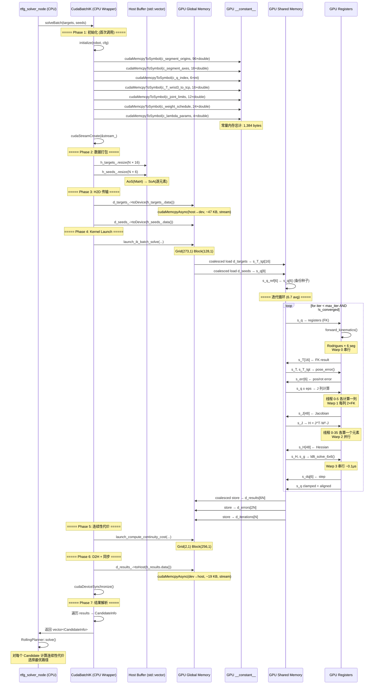
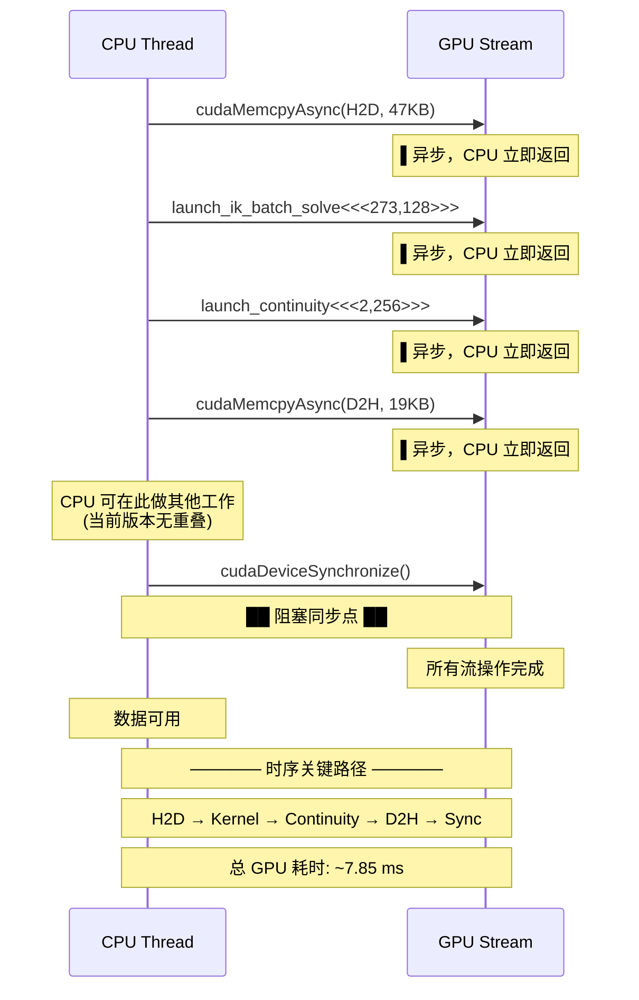

# CPU-GPU 完整时序图

## 单次 IK 批处理求解完整时序

## 同步点标识

## 关键时序指标

| 阶段 | 时间 (μs) | 操作 |
|------|-----------|------|
| H2D 传输 | 30 | cudaMemcpyAsync (47 KB) |
| Kernel Launch | 20 | CUDA runtime 开销 |
| ik_batch_solve | 6,434 | 273 Block × 6.7 iter |
| continuity_cost | 130 | 273 目标的连续性代价 |
| D2H 回读 | 20 | cudaMemcpyAsync (19 KB) |
| DeviceSync | 300 | 阻塞等待 |
| **总计** | **~7,850** | **< 8 ms** |
