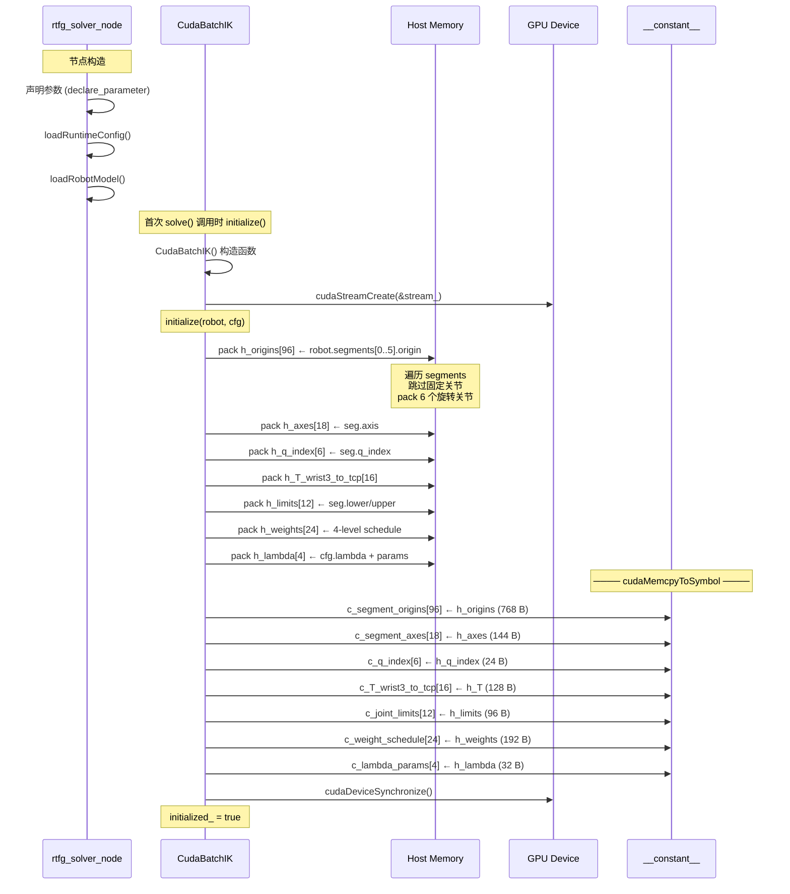
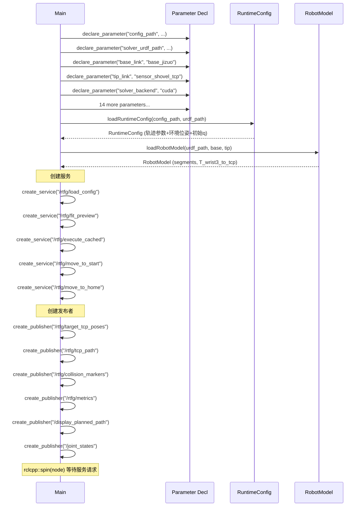

# 初始化流程

## 完整初始化时序



## 常量内存结构

### 内存占用明细

| 符号 | 类型 | 元素 | 字节 | 来源 (cuda_ik_solver.cu) |
|------|------|------|------|--------------------------|
| `c_segment_origins` | double | 96 | 768 | 行号 268 |
| `c_segment_axes` | double | 18 | 144 | 行号 270 |
| `c_q_index` | int | 6 | 24 | 行号 272 |
| `c_T_wrist3_to_tcp` | double | 16 | 128 | 行号 274 |
| `c_joint_limits` | double | 12 | 96 | 行号 276 |
| `c_weight_schedule` | double | 24 | 192 | 行号 278 |
| `c_lambda_params` | double | 4 | 32 | 行号 280 |
| **总计** | | | **1,384 B** | |

### 数据布局示例

```
c_segment_origins[96]:  6 segments × 16 doubles (4×4 row-major)
  [0..15]:   seg 0 (ur10_shoulder_pan)
  [16..31]:  seg 1 (ur10_shoulder_lift)
  [32..47]:  seg 2 (ur10_elbow)
  [48..63]:  seg 3 (ur10_wrist_1)
  [64..79]:  seg 4 (ur10_wrist_2)
  [80..95]:  seg 5 (ur10_wrist_3)

c_segment_axes[18]:  6 segments × 3 doubles (unit vector)
  [0..2]:    seg 0 axis (0, 0, 1)   → Z axis
  [3..5]:    seg 1 axis (0, 1, 0)   → Y axis
  [6..8]:    seg 2 axis (0, 1, 0)   → Y axis
  [9..11]:   seg 3 axis (0, 1, 0)   → Y axis
  [12..14]:  seg 4 axis (0, 0, -1)  → -Z axis
  [15..17]:  seg 5 axis (0, 1, 0)   → Y axis
```

## DeviceBuffer 分配流程

```mermaid
graph LR
    subgraph ensureCapacity [ensureCapacity(N)]
        direction TB
        CHK1{d_targets_ 存在<br/>且 size ≥ N×16?}
        CHK1 -->|No| MAL1[cudaMalloc: N×128 B]
        CHK1 -->|Yes| CHK2
        CHK2{d_seeds_ 存在<br/>且 size ≥ N×6?}
        CHK2 -->|No| MAL2[cudaMalloc: N×48 B]
        CHK2 -->|Yes| CHK3
        CHK3{d_results_ 存在<br/>且 size ≥ N×6?}
        CHK3 -->|No| MAL3[cudaMalloc: N×48 B]
        CHK3 -->|Yes| CHK4
        CHK4{d_errors_ 存在<br/>且 size ≥ N×2?}
        CHK4 -->|No| MAL4[cudaMalloc: N×16 B]
        CHK4 -->|Yes| CHK5
        CHK5{d_iterations_ 存在<br/>且 size ≥ N?}
        CHK5 -->|No| MAL5[cudaMalloc: N×8 B]
        CHK5 -->|Yes| READY[Ready for kernel launch]
    end
```

## CPU 端初始化流程



## 初始化后的设备状态

```
GPU 设备状态（初始完成后）:
┌────────────────────────────────────────────┐
│ CUDA Stream (stream_)                     │
│   └── non-blocking, default priority      │
├────────────────────────────────────────────┤
│ __constant__ (1,384 bytes, read-only)      │
│   ├── c_segment_origins: URDF 关节原点    │
│   ├── c_segment_axes: 旋转轴向量          │
│   ├── c_q_index: 关节索引映射             │
│   ├── c_T_wrist3_to_tcp: 工具偏移         │
│   ├── c_joint_limits: 关节限位            │
│   ├── c_weight_schedule: 权重调度表       │
│   └── c_lambda_params: 阻尼参数           │
├────────────────────────────────────────────┤
│ DeviceBuffer 池 (初始为空, 按需分配)      │
│   ├── d_targets_  (nullptr)               │
│   ├── d_seeds_    (nullptr)               │
│   ├── d_results_  (nullptr)               │
│   ├── d_errors_   (nullptr)               │
│   └── d_iterations_ (nullptr)             │
└────────────────────────────────────────────┘
```
