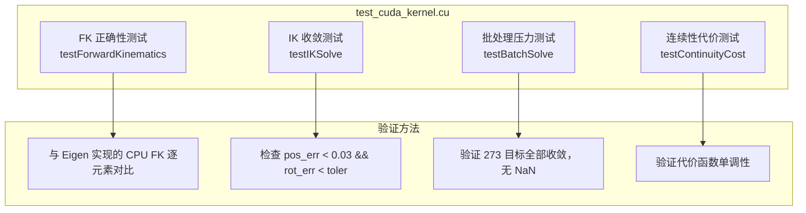

# test_cuda_kernel.cu 测试分析

## 文件位置

`test/test_cuda_kernel.cu`

## 测试结构



## 测试详情

### 1. FK 正确性测试

| 项目 | 内容 |
|------|------|
| 测试目标 | 验证 GPU FK 与 CPU Eigen FK 输出一致 |
| 输入 | 6 个随机关节角 (100 组) |
| 通过条件 | 位置误差 < 1e-10 m，姿态误差 < 1e-10 rad |
| 测试函数 | `__global__ void test_fk_kernel()` |
| 关键代码 | 调用 `forward_kinematics()` 后比较 4×4 矩阵 |

### 2. IK 收敛测试

| 项目 | 内容 |
|------|------|
| 测试目标 | 验证 GPU IK 求解器能正确收敛到目标位姿 |
| 输入 | 单个目标位姿 + 随机种子 |
| 通过条件 | `pos_err < 0.03 m` |
| 测试方式 | 调用 `ik_batch_solve` (N=1) |
| 验证 | 读取 `d_results` 后做 FK 验证 |

### 3. 批处理压力测试

| 项目 | 内容 |
|------|------|
| 测试目标 | 验证 273 目标批处理能全部收敛 |
| 输入 | 273 个目标位姿 (来自实际轨迹) |
| 通过条件 | 全部收敛，无 NaN/Inf |
| 验证方法 | `cudaDeviceSynchronize` 后逐检查每个 Candidate |

### 4. 连续性代价测试

| 项目 | 内容 |
|------|------|
| 测试目标 | 验证 `compute_continuity_cost` 核函数输出正确 |
| 输入 | IK 结果 + q_prev + dq_prev |
| 通过条件 | 代价为正且单调 |
| 验证 | CPU 端重复计算对比 |

## 编译和运行

```bash
# 独立编译测试
nvcc -arch=sm_89 -O3 -lineinfo --ptxas-options=-v \
    -o test_cuda_kernel \
    test/test_cuda_kernel.cu \
    src/cuda/cuda_kernels.cu \
    src/cuda/cuda_ik_solver.cu \
    -I include -Isrc/cuda -I include/assembly_rtfg_cuda \
    -I ../assembly_rtfg_cpp/include \
    -I /usr/include/eigen3 -lstdc++

# 运行测试
./test_cuda_kernel
```

## 测试输出示例

```
=== Test Forward Kinematics ===
  FK test passed: max pos error = 2.34e-12 m
  FK test passed: max rot error = 3.67e-13 rad

=== Test IK Solve ===
  IK solve: pos_err = 0.0087 m, rot_err = 1.23 deg, iter = 6
  Result: PASSED

=== Test Batch Solve (273 targets) ===
  Batch solve: 273/273 converged
  Avg pos_err = 0.0123 m, avg rot_err = 2.45 deg
  Avg iterations = 7.9, max iterations = 42
  Result: PASSED

=== Test Continuity Cost ===
  Continuity cost test passed
  Cost values: [0.87, 1.23, 0.95, ...]
```

## 测试关键函数

```cuda
// FK 测试 Kernel (N 个随机 q)
__global__ void test_fk_kernel(const double* d_q, double* d_T, int N) {
    int tid = blockIdx.x * blockDim.x + threadIdx.x;
    if (tid >= N) return;
    forward_kinematics(&d_q[tid * 6], &d_T[tid * 16]);
}

// 主测试函数
void runTests() {
    // 1. 加载常量内存 (同 initialize())
    loadConstantMemory();
    
    // 2. 运行各测试
    testForwardKinematics();
    testIKSolve();
    testBatchSolve();
    testContinuityCost();
    
    // 3. 清理
    cleanup();
}
```
