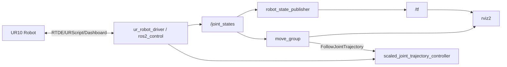

# ur10_real_control_ros2

`ur10_real_control_ros2` 用于在 Linux 直连网络环境下，通过官方 `ur_robot_driver` 将真实 UR10、RViz2 和 MoveIt2 串成同一条控制链。

## 功能

- 读取真实机械臂 `/joint_states`，让 RViz2 中的装配模型与实机姿态保持一致
- 在实机运动时持续同步 RViz2 模型
- 通过 MoveIt2 的 `Plan / Execute` 向真实机械臂发送轨迹
- 采用当前 `assembly` 的碰撞豁免范围，而不是全局禁碰撞
- 提供一个 GUI 页面用于启动、预检和清理残余进程

## 通讯协议

- ROS 2 节点间：Topic / TF / Action / Service
- 实机驱动：`ur_robot_driver`
- 机器人底层协议：
  - RTDE
  - URScript
  - Dashboard Server
- MoveIt2 执行接口：
  - `/scaled_joint_trajectory_controller/follow_joint_trajectory`

## 默认网络参数

- `robot_ip=10.160.9.21`
- `reverse_ip=10.160.9.100`
- `reverse_port=50001`
- `script_sender_port=50002`
- `trajectory_port=50003`
- `script_command_port=50004`

## 构建

```bash
cd /home/liuxiaopeng/ur10_conrtol/ur_base_xarco_model
source /opt/ros/humble/setup.bash
source /home/liuxiaopeng/ws_moveit2/install/setup.bash
colcon build --symlink-install --packages-select ur10_real_control_ros2
```

## 启动

主 launch：

```bash
source /opt/ros/humble/setup.bash
source /home/liuxiaopeng/ws_moveit2/install/setup.bash
source /home/liuxiaopeng/ur10_conrtol/ur_base_xarco_model/install/setup.bash
ros2 launch ur10_real_control_ros2 ur10_real_control.launch.py
```

GUI：

```bash
source /opt/ros/humble/setup.bash
source /home/liuxiaopeng/ws_moveit2/install/setup.bash
source /home/liuxiaopeng/ur10_conrtol/ur_base_xarco_model/install/setup.bash
ros2 launch ur10_real_control_ros2 real_control_gui.launch.py
```

## ROS 2 节点图



## 碰撞豁免范围

该包不使用“全放开碰撞”策略，而是镜像当前 `ur_base_xarco_model/assembly_moveit_config/srdf/assembly.srdf` 的豁免思路：

- UR10 相邻关节 link 的碰撞豁免
- `sensor_shovel` 与机械臂本体 link 的特定豁免
- `sensor_shovel_tcp` 与机械臂本体 link 的特定豁免
- `tool0` 与 `sensor_shovel` 的固定连接豁免

对应实现见：

- `config/assembly_real.srdf`

## 残余进程清理

手动清理：

```bash
source /opt/ros/humble/setup.bash
source /home/liuxiaopeng/ws_moveit2/install/setup.bash
source /home/liuxiaopeng/ur10_conrtol/ur_base_xarco_model/install/setup.bash
ros2 run ur10_real_control_ros2 cleanup_real_control_processes.sh
```

该脚本会尝试终止：

- `ur_ros2_control_node`
- `dashboard_client`
- `controller_stopper`
- `robot_state_helper`
- `move_group`
- `rviz2`
- `robot_state_publisher`
- 本包 GUI / launch 进程

## 实机联调

当前阶段只完成了无实机构建与启动验证。实验室现场联调步骤见：

- `docs/real_hardware_lab_validation.md`
