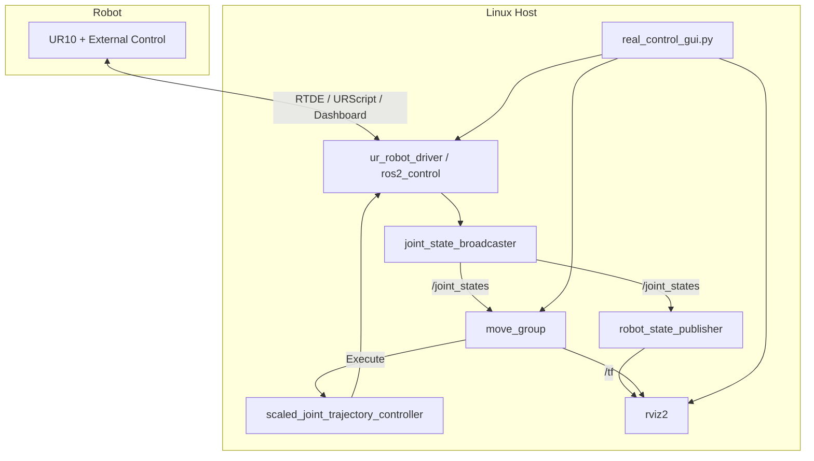

# 系统架构

## 运行原则

1. 真实姿态来源只能是官方 driver 发布的 `/joint_states`
2. 不能同时运行 `joint_state_publisher_gui` 或其他伪状态源
3. MoveIt2 只通过 `scaled_joint_trajectory_controller` 执行真实轨迹
4. 碰撞豁免按 `assembly_real.srdf` 的有限范围执行，不采用全局禁碰撞
